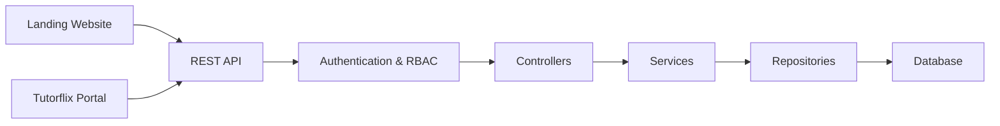

# 15. API Architecture

## Purpose

This document defines the API architecture for the Tutorflix platform.

The backend exposes a RESTful API that serves both frontend applications:

- Landing Website
- Tutorflix Portal

The API is the single entry point for all client communication and is responsible for processing requests, enforcing security, and coordinating business operations.

---

# API Architecture



---

# API Design Principles

The API follows these principles:

- RESTful architecture
- Stateless requests
- JSON request and response bodies
- JWT Authentication
- Versioned endpoints
- Consistent error responses
- Resource-oriented URLs

---

# API Versioning

All endpoints are versioned.

Example

```text
/api/v1/
```

Future versions

```text
/api/v2/
```

Versioning allows new functionality without breaking existing clients.

---

# Base URL

Development

```text
http://localhost:3000/api/v1
```

Production

```text
https://api.tutorflix.com/api/v1
```

---

# Request Lifecycle

```mermaid
flowchart LR

Client

-->

REST API

-->

Authentication

-->

RBAC

-->

Validation

-->

Controller

-->

Service

-->

Repository

-->

Database

-->

Response
```

---

# API Modules

```text
/api/v1

/auth

/users

/leads

/trials

/students

/parents

/tutors

/classes

/packages

/payments

/chat

/reports

/admin
```

Each module manages its own resources.

---

# Request Format

Example

```http
POST /api/v1/students
```

```json
{
  "firstName": "Ali",
  "lastName": "Ahmed"
}
```

---

# Success Response

```json
{
  "success": true,
  "message": "Student created successfully.",
  "data": {}
}
```

---

# Error Response

```json
{
  "success": false,
  "message": "Student not found.",
  "errors": []
}
```

---

# HTTP Status Codes

| Code | Meaning |
|------|---------|
| 200 | Success |
| 201 | Resource Created |
| 204 | No Content |
| 400 | Bad Request |
| 401 | Unauthorized |
| 403 | Forbidden |
| 404 | Not Found |
| 409 | Conflict |
| 422 | Validation Failed |
| 500 | Internal Server Error |

---

# Authentication

Protected endpoints require a JWT access token.

Example

```http
Authorization: Bearer <access_token>
```

Authentication is validated before request processing.

---

# Authorization

After authentication, RBAC middleware verifies the user's permissions before allowing access to protected resources.

---

# Validation

Incoming requests are validated before reaching the controller.

Validation includes:

- Required fields
- Data types
- Business rules
- Enum validation

Invalid requests return a **422 Validation Failed** response.

---

# Pagination

Collection endpoints support pagination.

Example

```text
GET /students?page=1&pageSize=20
```

---

# Filtering

Example

```text
GET /students?status=ACTIVE
```

---

# Sorting

Example

```text
GET /students?sort=createdAt&order=desc
```

---

# Searching

Example

```text
GET /students?search=Ali
```

---

# File Uploads

Files are uploaded through dedicated API endpoints.

Examples

- Payment receipts
- Profile pictures
- Chat attachments
- Learning resources

Uploaded files are stored in Supabase Storage.

---

# Error Handling

All errors follow a consistent structure.

Validation errors return field-level information where applicable.

Unexpected server errors are logged and return a generic response to the client.

---

# API Security

The API implements:

- HTTPS
- JWT Authentication
- RBAC Authorization
- Request Validation
- Rate Limiting
- Centralized Error Handling

---

# Future Enhancements

The architecture supports future additions including:

- Webhooks
- GraphQL Gateway
- Public API
- API Keys
- WebSocket Endpoints
- API Rate Plans

---

# Design Decisions

- REST is the primary communication protocol.
- All endpoints are versioned.
- The API is stateless.
- Authentication and authorization are handled through middleware.
- Business logic resides in the Service Layer.
- Responses follow a standardized format.
- Files are stored in Supabase Storage.
- The API serves both frontend applications.

---

# Related Documents

- 05-backend-architecture.md
- 13-authentication-architecture.md
- 14-rbac-architecture.md
- 16-frontend-architecture.md
- 17-deployment-architecture.md
