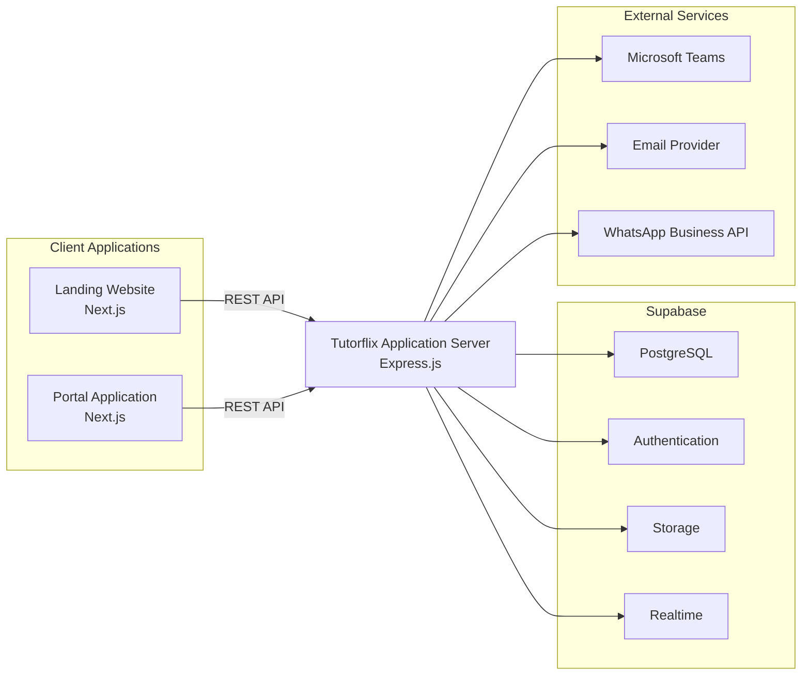
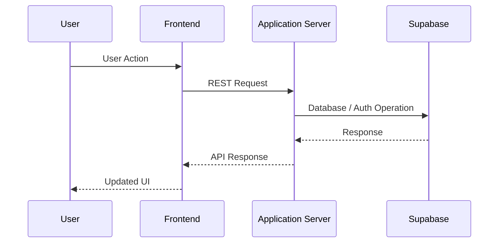

# 03. Application Architecture

## Purpose

This document describes the major software applications that compose the Tutorflix platform, their responsibilities, and the communication between them.

Tutorflix follows a distributed application architecture where the marketing website, authenticated portal, backend server, managed backend services, and external integrations work together to deliver the platform.

Each application has a clearly defined responsibility and communicates only through approved interfaces.

---

# Architecture Style

Tutorflix follows a **Client–Server Architecture** with a centralized Application Server.

Key architectural characteristics include:

- Two independent frontend applications
- Centralized backend server
- RESTful API communication
- Managed backend services (Supabase)
- External service integrations
- Role-Based Access Control (RBAC)
- Stateless backend services

---

# High-Level Application Architecture

---

# Applications

## Landing Website

### Purpose

Provides the public-facing marketing website.

### Responsibilities

- Marketing pages
- Subject information
- Tutor information
- Trial booking
- Contact forms
- SEO
- Future blog

### Accessible By

- Visitors
- Prospective students
- Parents

### Technology

- Next.js

---

## Portal Application

### Purpose

Provides authenticated access to all platform functionality.

The Portal Application serves every internal user through Role-Based Access Control (RBAC).

Different dashboards and features are displayed depending on the authenticated user's role.

### Available Portals

- Student Portal
- Parent Portal
- Tutor Portal
- Admin Portal

### Responsibilities

- Authentication
- Dashboards
- Scheduling
- Chat
- Student management
- Tutor management
- Payments
- Reports
- Settings

### Technology

- Next.js

---

## Tutorflix Application Server

### Purpose

Acts as the central processing unit of the platform.

All business logic is executed within the Application Server.

### Responsibilities

- REST APIs
- Authentication validation
- RBAC
- Business rules
- Scheduling
- Lead conversion
- Trial management
- Student management
- Tutor management
- Payment processing
- Notification orchestration
- Chat moderation
- Report generation
- Integration with external services

### Technology

- Express.js

---

## Supabase Platform

Supabase provides managed backend infrastructure.

### Services

#### PostgreSQL

Primary relational database.

#### Authentication

User authentication and session management.

#### Storage

File storage for:

- Payment receipts
- User profile pictures
- Documents
- Learning resources

#### Realtime

Used for:

- Chat
- Notifications
- Live updates

---

## External Services

### Microsoft Teams

Responsible for:

- Online tutoring sessions
- Meeting creation
- Joining classes

---

### Email Provider

Responsible for:

- Account verification
- Password reset
- Notifications
- Payment confirmation

---

### WhatsApp Business API

Responsible for:

- Parent communication
- Appointment reminders
- Important notifications

---

# Application Communication

Applications communicate according to the following rules.

## Rule 1

Frontend applications never communicate directly with Supabase.

---

## Rule 2

Frontend applications never communicate directly with each other.

---

## Rule 3

All requests pass through the Tutorflix Application Server.

---

## Rule 4

Only the Application Server can access:

- Database
- Authentication
- Storage
- Realtime

---

## Communication Flow

---

# Architectural Constraints

The following constraints apply throughout the system.

- Business logic must not exist in frontend applications.
- Database access is restricted to the Application Server.
- Authentication is handled by Supabase Authentication.
- Authorization is handled by the Application Server.
- External services are accessed only through the Application Server.
- All API endpoints require authentication unless explicitly marked as public.

---

# Scalability

The architecture supports independent scaling of each application.

Examples:

- Scale the Portal Application without affecting the Landing Website.
- Scale the Application Server independently.
- Increase database resources independently through Supabase.
- Add additional frontend applications in the future (e.g., Mobile App).

---

# Future Expansion

The architecture is designed to support future applications such as:

- Mobile Application
- Internal Analytics Dashboard
- AI Assistant
- Tutor Mobile App
- Parent Mobile App
- Student Mobile App

These applications can reuse the existing Application Server without major architectural changes.

---

# Design Decisions

- Two independent frontend applications are used to separate marketing and operational concerns.
- A centralized Application Server contains all business logic.
- Supabase is used only as managed infrastructure.
- All frontend applications communicate through REST APIs.
- RBAC controls feature visibility inside the Portal Application.
- CRM functionality is implemented as administrative features rather than a separate application.
- External services are isolated behind the Application Server to simplify integrations and improve security.

---

# Related Documents

- 02-repository-architecture.md
- 04-domain-architecture.md
- 05-backend-architecture.md
- 06-database-architecture.md
