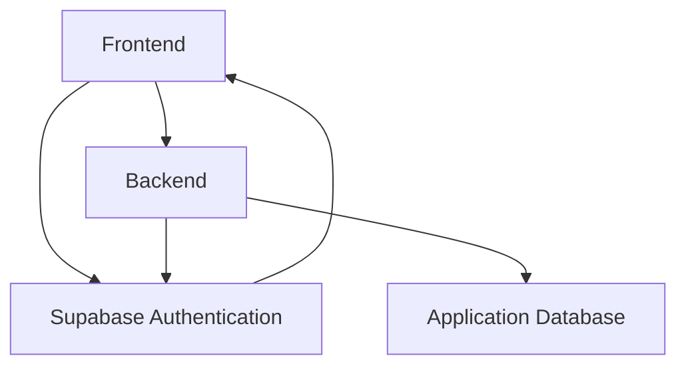
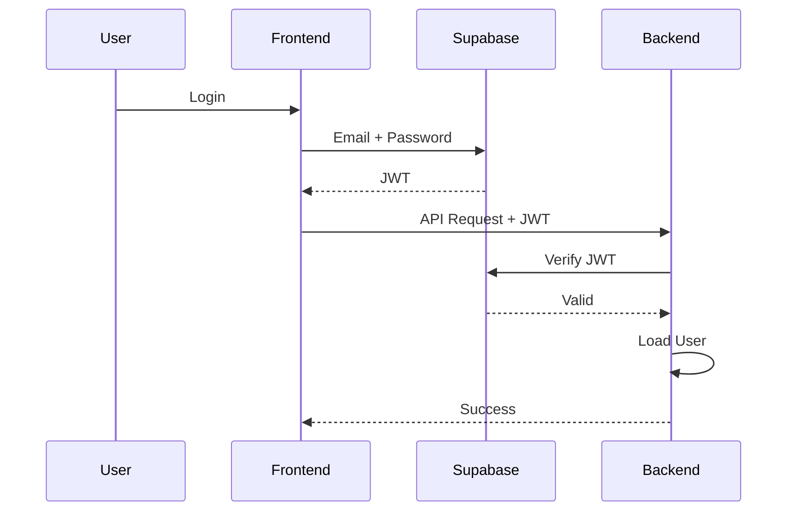

# 13. Authentication Architecture

## Purpose

This document defines the authentication architecture of the Tutorflix platform.

Authentication is responsible for verifying user identity before granting access to protected resources. Tutorflix delegates identity management to **Supabase Authentication**, while the application server manages authorization, user profiles, and business logic.

Authentication and authorization are intentionally separated to improve scalability, maintainability, and security.

---

# Authentication Overview

Tutorflix uses a token-based authentication model.

```mermaid
flowchart LR

User

-->

Frontend

-->

Supabase Auth

-->

JWT Access Token

-->

Backend API

-->

Protected Resources
```

The frontend authenticates users through Supabase Authentication and receives a JWT Access Token.

The token accompanies every authenticated request to the backend.

The backend validates the token before processing the request.

---

# Authentication Components



---

# Responsibilities

## Supabase Authentication

Responsible for:

- User registration
- Login
- Password hashing
- Password reset
- Email verification
- Session management
- JWT generation
- Refresh tokens

---

## Backend

Responsible for:

- JWT verification
- Loading application user
- Loading roles
- RBAC authorization
- Business rules

The backend never stores passwords.

---

# Authentication Flow

## Login



---

## Protected Request

```mermaid
flowchart LR

Request

-->

Authorization Header

-->

JWT Verification

-->

Load User

-->

Authentication Success

-->

RBAC Middleware

-->

Controller
```

If authentication fails:

- 401 Unauthorized

If authorization fails:

- 403 Forbidden

---

# Registration Flow

Tutorflix supports administrator-controlled onboarding.

Users are created by authorized staff.

Examples:

- Admin creates Student
- Admin creates Parent
- Admin creates Tutor
- Admin creates Staff Member

The system sends an invitation email to set a password.

Public registration is not supported.

---

# Password Reset

```text
User

↓

Forgot Password

↓

Supabase Email

↓

Reset Link

↓

New Password

↓

Login
```

Password reset is handled entirely by Supabase.

---

# Session Management

Supabase manages:

- Access Tokens
- Refresh Tokens
- Session expiration

The backend remains stateless.

---

# JWT Structure

The JWT identifies the authenticated user.

Example claims:

```json
{
  "sub": "user-id",
  "email": "user@example.com",
  "aud": "authenticated",
  "exp": 1730000000
}
```

Authorization information is **not trusted directly from the JWT**.

The backend always loads the user's current roles and permissions from the database.

This prevents stale permissions after role changes.

---

# Authentication Middleware

Every protected request passes through the Authentication Middleware.

Responsibilities:

1. Extract JWT
2. Verify token with Supabase
3. Load application user
4. Attach authenticated user to request
5. Continue request

---

# Authentication States

A request may be in one of the following states.

| State | Result |
|---------|--------|
| Authenticated | Continue |
| Invalid Token | 401 Unauthorized |
| Expired Token | 401 Unauthorized |
| Missing Token | 401 Unauthorized |
| Disabled User | 403 Forbidden |

---

# Security Principles

Tutorflix follows these security principles.

## Password Security

Passwords are never stored by the application.

Supabase manages password hashing and verification.

---

## Stateless Backend

The backend stores no user sessions.

Authentication is based entirely on JWT verification.

---

## HTTPS Only

Authentication tokens are transmitted only over HTTPS.

---

## Least Privilege

Authentication verifies identity only.

Authorization is handled separately through RBAC.

---

## Token Validation

Every protected request validates the JWT before executing business logic.

---

# Future Enhancements

The architecture supports future additions including:

- Google Login
- Microsoft Login
- GitHub Login
- Multi-Factor Authentication (MFA)
- Single Sign-On (SSO)
- Magic Links
- Device Management
- Session Revocation

No changes to the application architecture are required to support these features.

---

# Design Decisions

- Supabase Authentication manages user identity.
- PostgreSQL stores application-specific user data.
- Passwords are never handled by the backend.
- JWT tokens authenticate every protected request.
- The backend validates every token before processing requests.
- Authentication and authorization are implemented as separate architectural concerns.
- The backend remains stateless.
- Public self-registration is disabled.
- New users are provisioned by authorized staff through the administration portal.

---

# Related Documents

- 08-foundation-erd.md
- 14-rbac-architecture.md
- 15-api-architecture.md
- 17-deployment-architecture.md
