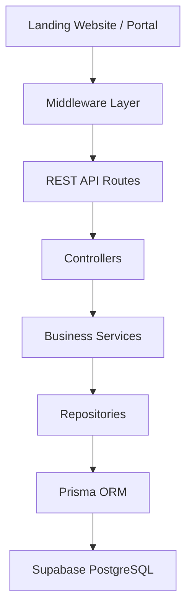
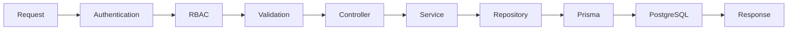

# 05. Backend Architecture

## Purpose

This document defines the internal architecture of the Tutorflix Application Server.

The backend serves as the central execution engine of the platform. It is responsible for processing business logic, enforcing authorization, managing integrations, coordinating workflows, and interacting with the database.

Tutorflix follows a **Modular Monolith Architecture** organized around business domains. Each domain encapsulates its own APIs, business rules, validation, and data access while sharing common infrastructure.

---

# Architecture Style

The backend is designed using the following architectural patterns:

- Modular Monolith
- Layered Architecture
- Domain-Oriented Modules
- Repository Pattern
- REST API
- Stateless Request Processing
- Dependency Injection Ready
- Shared Infrastructure Layer

---

# High-Level Backend Architecture



---

# Backend Directory Structure

```text
src/

├── config/
│
├── core/
│   ├── errors/
│   ├── logger/
│   ├── responses/
│   ├── constants/
│   └── base/
│
├── middleware/
│   ├── auth.middleware.ts
│   ├── rbac.middleware.ts
│   ├── validation.middleware.ts
│   ├── error.middleware.ts
│   ├── rateLimit.middleware.ts
│   └── requestLogger.middleware.ts
│
├── integrations/
│   ├── supabase/
│   ├── microsoft-teams/
│   ├── email/
│   ├── whatsapp/
│   └── payments/
│
├── modules/
│   ├── auth/
│   ├── users/
│   ├── leads/
│   ├── trials/
│   ├── students/
│   ├── parents/
│   ├── tutors/
│   ├── scheduling/
│   ├── packages/
│   ├── payments/
│   ├── communication/
│   ├── reports/
│   └── administration/
│
├── routes/
│
├── utils/
│
├── app.ts
│
└── server.ts
```

---

# Module Structure

Every domain module follows the same internal structure.

Example:

```text
students/

student.controller.ts

student.service.ts

student.repository.ts

student.routes.ts

student.validation.ts

student.types.ts

student.mapper.ts

index.ts
```

Every module owns:

- Routes
- Controller
- Service
- Repository
- Validation
- Types
- Mapping

No other module directly accesses another module's repository.

---

# Request Lifecycle

Every incoming request follows the same pipeline.



---

# Layer Responsibilities

## Routes

Responsibilities

- Register API endpoints
- Apply middleware
- Forward requests

Routes contain no business logic.

---

## Middleware

Responsibilities

- Authentication
- RBAC
- Validation
- Logging
- Rate Limiting
- Global Error Handling

Middleware executes before controllers.

---

## Controllers

Responsibilities

- Receive HTTP requests
- Parse request data
- Invoke business services
- Return HTTP responses

Controllers should remain thin.

---

## Services

The Service Layer contains the application's business logic.

Responsibilities

- Business rules
- Workflow orchestration
- Validation beyond schema validation
- Cross-domain coordination
- Transactions

Examples

- Convert Lead
- Schedule Trial
- Assign Tutor
- Verify Payment
- Moderate Chat Message

---

## Repositories

Repositories abstract all database interaction.

Responsibilities

- CRUD operations
- Query optimization
- Transactions
- Mapping database records

Repositories never contain business rules.

---

## Prisma ORM

Responsibilities

- Generate SQL
- Manage relationships
- Type-safe queries
- Migrations

---

## PostgreSQL

Stores all persistent business data.

Managed through Supabase.

---

# Core Infrastructure

The **core** layer contains reusable backend infrastructure.

## Errors

- Custom Exceptions
- Error Codes
- HTTP Errors

---

## Logger

Centralized application logging.

Future integrations:

- Winston
- Pino

---

## Response Helpers

Standardized API responses.

Example

Success

```json
{
  "success": true,
  "data": {}
}
```

Error

```json
{
  "success": false,
  "message": "Forbidden"
}
```

---

## Constants

Shared constants

Examples

- Roles
- Permissions
- Statuses
- Message Types
- Notification Types

---

# Integrations

External systems are isolated inside the integrations layer.

## Supabase

Provides

- Authentication
- Database
- Storage
- Realtime

---

## Microsoft Teams

Responsibilities

- Meeting creation
- Join links
- Meeting management

---

## Email Provider

Responsibilities

- Welcome emails
- Password reset
- Notifications

---

## WhatsApp

Responsibilities

- Parent notifications
- Reminders
- Alerts

---

## Payment Providers

Current

- Manual Verification

Future

- Stripe
- PayPal
- Local Payment Gateway

The Payment module communicates only with the payment integration layer.

---

# Business Modules

| Module | Responsibility |
|----------|----------------|
| Authentication | Login and sessions |
| Users | User profiles and roles |
| Leads | Lead management |
| Trials | Trial lessons |
| Students | Student lifecycle |
| Parents | Parent management |
| Tutors | Tutor lifecycle |
| Scheduling | Classes and calendars |
| Packages | Lesson packages |
| Payments | Payment processing |
| Communication | Chat and notifications |
| Reports | Reporting and analytics |
| Administration | Settings, moderation, audit logs |

---

# Design Principles

The backend follows these principles.

## Single Responsibility

Each module has one responsibility.

---

## Domain Ownership

Every business capability belongs to exactly one module.

---

## Loose Coupling

Modules communicate through services rather than direct database access.

---

## Thin Controllers

Controllers delegate all work to services.

---

## Centralized Business Logic

Business rules exist only within services.

---

## Infrastructure Isolation

External services are accessed exclusively through the integrations layer.

---

## Stateless Processing

The backend stores no session state in memory.

---

# Future Enhancements

The architecture supports future additions without restructuring.

Possible enhancements include

- Redis Cache
- BullMQ Job Queue
- WebSockets
- AI Moderation Service
- AI Scheduling Assistant
- Search Engine
- Event Bus
- Microservices (if needed)

---

# Design Decisions

- Backend organized by business domains rather than technical layers.
- Shared infrastructure is isolated from business modules.
- Integrations are separated from application logic.
- Prisma is the only ORM used for database access.
- Supabase provides managed infrastructure only.
- Controllers remain thin.
- Business logic resides exclusively within services.
- Repository Pattern isolates persistence logic.
- The backend remains a Modular Monolith until operational requirements justify decomposition.

---

# Related Documents

- 04-domain-architecture.md
- 06-database-architecture.md
- 07-authentication-rbac.md
- 09-deployment-architecture.md
- 10-api-architecture.md
