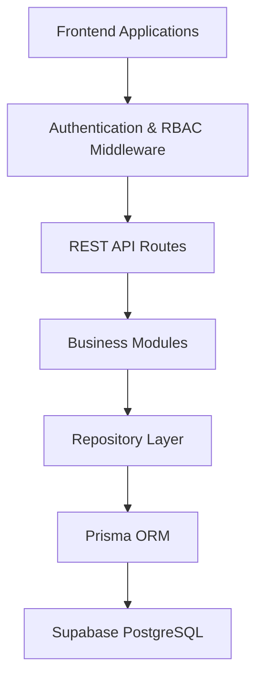
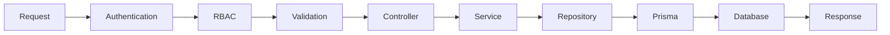
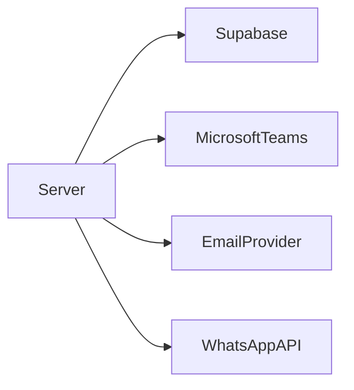

# 05. Backend Architecture

## Purpose

This document describes the internal architecture of the Tutorflix Application Server.

The backend is responsible for executing all business logic, enforcing authorization, validating requests, orchestrating integrations, and managing communication with the database and external services.

Tutorflix follows a **Modular Layered Architecture**, where each business domain is implemented as an independent module while sharing common infrastructure.

---

# Architecture Style

The backend follows:

- Modular Monolith
- Layered Architecture
- RESTful API
- Domain-Oriented Design
- Repository Pattern
- Dependency Injection (Future)
- Stateless Services

---

# High-Level Backend Architecture



---

# Backend Structure

```text
src/

├── config/
│
├── middleware/
│
├── modules/
│   │
│   ├── auth/
│   ├── users/
│   ├── leads/
│   ├── trials/
│   ├── students/
│   ├── parents/
│   ├── tutors/
│   ├── scheduling/
│   ├── packages/
│   ├── payments/
│   ├── communication/
│   ├── reports/
│   └── administration/
│
├── shared/
│
├── utils/
│
├── routes/
│
├── app.ts
│
└── server.ts
```

---

# Module Structure

Every business module follows the same structure.

Example:

```text
students/

├── student.controller.ts

├── student.service.ts

├── student.repository.ts

├── student.routes.ts

├── student.validation.ts

├── student.types.ts

└── index.ts
```

This ensures consistency across the entire backend.

---

# Request Lifecycle

Every request follows the same processing pipeline.



---

# Layer Responsibilities

## Routes

Responsibilities:

- Register endpoints
- Apply middleware
- Forward requests

Routes contain no business logic.

---

## Middleware

Responsibilities:

- Authentication
- RBAC
- Request Logging
- Rate Limiting
- Error Handling

---

## Controllers

Responsibilities:

- Receive HTTP requests
- Parse parameters
- Call Services
- Return HTTP responses

Controllers contain minimal logic.

---

## Services

The Service Layer contains the core business logic.

Responsibilities:

- Validation
- Business rules
- Workflow orchestration
- Domain operations

Examples:

- Convert Lead
- Schedule Class
- Assign Tutor
- Verify Payment
- Send Notifications

---

## Repository Layer

Repositories isolate database access.

Responsibilities:

- CRUD operations
- Query optimization
- Transactions
- Data mapping

Repositories never contain business logic.

---

## Prisma ORM

Responsibilities:

- Generate SQL queries
- Type-safe database access
- Relationship handling
- Migrations

---

## PostgreSQL

Stores all persistent application data.

Managed through Supabase.

---

# Shared Components

The backend includes shared infrastructure used by all modules.

## Authentication

JWT verification using Supabase Auth.

---

## RBAC

Checks user permissions before accessing protected resources.

---

## Validation

Request validation using Zod.

---

## Logger

Centralized logging for debugging and monitoring.

---

## Error Handler

Provides consistent API error responses.

---

## Configuration

Loads:

- Environment variables
- Secrets
- API Keys
- Feature flags

---

# Business Modules

| Module | Responsibility |
|----------|----------------|
| Authentication | Authentication & Sessions |
| Users | User accounts and roles |
| Leads | Lead lifecycle |
| Trials | Trial management |
| Students | Student lifecycle |
| Parents | Parent management |
| Tutors | Tutor management |
| Scheduling | Classes and calendars |
| Packages | Purchased lesson hours |
| Payments | Payment processing |
| Communication | Chat & notifications |
| Reports | Analytics |
| Administration | Settings & audit logs |

---

# External Integrations

The backend integrates with external services.



The frontend never communicates with these services directly.

---

# Design Principles

The backend follows these principles.

### Single Responsibility

Every module has one responsibility.

---

### Separation of Concerns

Controllers, services, repositories, and validation are separated.

---

### Stateless Processing

Requests do not depend on server memory.

---

### Centralized Business Logic

Business rules exist only within the Service Layer.

---

### Reusable Infrastructure

Shared middleware and utilities are reused across all modules.

---

# Future Improvements

The architecture supports future additions such as:

- Background Job Queue
- Redis Caching
- WebSockets
- AI Services
- Payment Providers
- Event Bus
- Microservices (if required)

These additions can be introduced without major restructuring.

---

# Design Decisions

- Backend organized by business domains rather than technical layers.
- All business logic resides in the Service Layer.
- Database access is isolated through repositories.
- Prisma provides type-safe ORM functionality.
- Authentication is delegated to Supabase Auth.
- Authorization is enforced using RBAC middleware.
- External services are accessed exclusively through the backend.
- The backend remains a modular monolith until scaling requirements justify decomposition into microservices.

---

# Related Documents

- 04-domain-architecture.md
- 06-database-architecture.md
- 07-authentication-rbac.md
- 09-deployment-architecture.md
- 10-api-architecture.md
