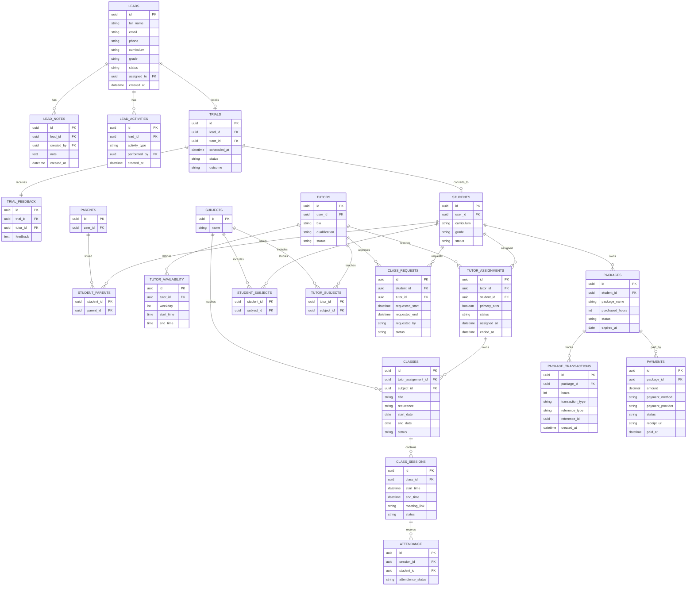

# 09. Business ERD

## Purpose

This document defines the core business entities of the Tutorflix platform.

The Business Layer models the complete operational workflow of the academy, including lead management, trial lessons, student enrollment, tutor assignments, scheduling, lesson packages, attendance, and payment processing.

---

# Entity Relationship Diagram



---

# Business Workflow

```mermaid
flowchart LR

Lead

-->

Trial

-->

Student

-->

Tutor Assignment

-->

Package Purchase

-->

Payment

-->

Class Request

-->

Class

-->

Class Session

-->

Attendance

-->

Package Transaction
```

---

# Package Balance

Package hours are **not stored directly**.

The available balance is calculated from `PACKAGE_TRANSACTIONS`.

Example:

| Transaction | Hours |
|-------------|------:|
| Package Purchase | +20 |
| Class Completed | -1 |
| Makeup Credit | +1 |
| Refund | -2 |

Current Balance = **18 Hours**

This approach ensures a complete audit trail and prevents inconsistencies.

---

# Payment Model

The payment system is provider-independent.

## Current Provider

- Manual Verification

## Future Providers

- Stripe
- PayPal
- Local Payment Gateways

### Payment Method

Examples:

- Manual
- Credit Card
- Bank Transfer
- Wallet

### Payment Provider

Examples:

- Manual
- Stripe
- PayPal

This allows new payment gateways to be introduced without changing the business model.

---

# Scheduling Model

Scheduling is divided into three stages:

1. **Class Request** – A student, parent, tutor, or admin requests a lesson.
2. **Class** – Represents the recurring lesson or course.
3. **Class Session** – Represents each individual lesson occurrence.

This separation supports recurring schedules, cancellations, rescheduling, attendance, and makeup lessons without duplicating class information.

---

# Design Decisions

- Leads are converted into Students after successful trials.
- Tutors are assigned through Tutor Assignments.
- Scheduling separates requests, recurring classes, and individual sessions.
- Parents and Students have a many-to-many relationship.
- Subjects are linked independently to students and tutors.
- Package balances are derived from Package Transactions.
- Payments use a provider-independent architecture.
- Tutor availability is independent of scheduled classes.
- Individual attendance is tracked per Class Session.
