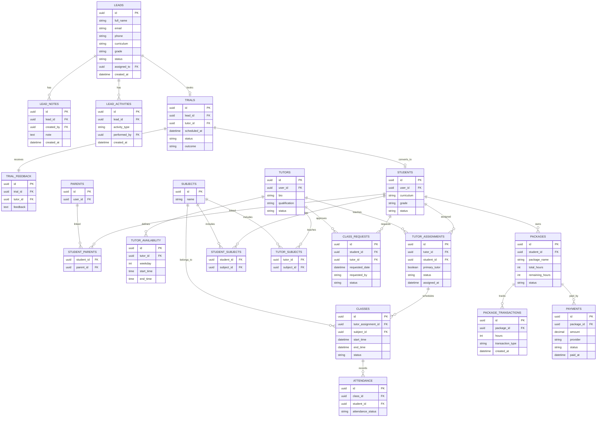

# 09. Business ERD

## Purpose

This document defines the core business entities of the Tutorflix platform.

The Business Layer represents the operational workflow of the academy, including lead management, trial classes, student enrollment, tutor assignments, scheduling, lesson packages, and payment processing.

---

# Entity Relationship Diagram



---

# Business Workflow

```mermaid
flowchart LR

Lead

-->

Trial

-->

Student

-->

Tutor Assignment

-->

Package

-->

Payment

-->

Class Request

-->

Class

-->

Attendance
```

---

# Entity Responsibilities

| Entity | Responsibility |
|---------|----------------|
| Leads | Prospective students |
| Lead Notes | Follow-up notes |
| Lead Activities | Lead history |
| Trials | Introductory lessons |
| Trial Feedback | Tutor evaluation of the trial |
| Students | Enrolled learners |
| Parents | Parent or guardian records |
| Student Parents | Student–parent relationship |
| Tutors | Tutor profiles |
| Tutor Availability | Weekly availability schedule |
| Tutor Assignments | Student–tutor assignments and history |
| Subjects | Subjects offered by the academy |
| Student Subjects | Subjects studied by students |
| Tutor Subjects | Subjects taught by tutors |
| Class Requests | Requested lesson schedule |
| Classes | Confirmed lessons |
| Attendance | Attendance tracking |
| Packages | Purchased lesson packages |
| Package Transactions | Package hour adjustments |
| Payments | Payment records |

---

# Design Decisions

- Leads are converted into Students after successful trials.
- Tutors are assigned through the Tutor Assignments entity rather than directly to students.
- Scheduling is separated into Class Requests and Classes.
- Parents and Students use a many-to-many relationship.
- Subjects are shared between students and tutors.
- Payments are linked to Packages rather than directly to Students.
- Package balances are maintained through Package Transactions.
- Tutor availability is managed separately from scheduled classes.
