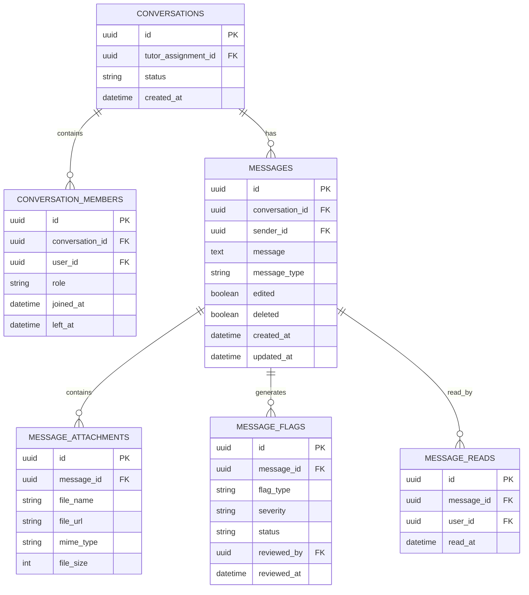

# 10. Communication ERD

## Purpose

This document defines the communication model of the Tutorflix platform.

The Communication Layer provides secure, moderated communication between students, tutors, parents, and administrators.

Unlike traditional messaging systems, Tutorflix uses a **shared conversation model** where one conversation exists for each Student–Tutor relationship. Parents and administrators participate in the same conversation according to their assigned permissions.

---

# Entity Relationship Diagram



---

# Communication Model

Each Student–Tutor assignment owns a single conversation.

```text
Tutor Assignment

        │

        ▼

Conversation

        │

 ┌──────┼─────────┐

 ▼      ▼         ▼

Tutor Student Parent

        │

        ▼

Admin (Monitoring)
```

A student and tutor always communicate through the same conversation, regardless of the number of classes or subjects.

---

# Conversation Participants

Possible members include:

- Student
- Tutor
- Parent
- Admin

Permissions are controlled using RBAC.

Administrators may join or monitor any conversation.

---

# Message Lifecycle

```text
User Sends Message

↓

Request Validation

↓

Moderation Service

↓

Phone Number Detection

↓

Email Detection

↓

URL Detection

↓

Profanity Detection

↓

AI Moderation (Future)

↓

Flag Creation (if required)

↓

Store Message

↓

Realtime Broadcast

↓

Create Notifications
```

---

# Moderation Model

Messages are automatically analyzed before delivery.

Supported flag types include:

- Phone Number
- Email Address
- External URL
- Profanity
- Payment Discussion
- Suspicious Behaviour
- AI Flag (Future)

Each flag has a review workflow.

Example statuses:

- Pending
- Reviewed
- Dismissed
- Action Taken

---

# Attachments

Messages may contain attachments.

Supported examples:

- Images
- PDFs
- Documents
- Homework Files

Files are stored in **Supabase Storage**.

The database stores only metadata and file paths.

---

# Read Receipts

Every participant maintains an independent read status.

This enables:

- Unread message counts
- "Seen" indicators
- Notification management

---

# Notifications

Notifications are generated for events such as:

- New message
- Message mention (Future)
- Tutor reply
- Admin announcement
- Flag review
- System alerts

Notifications are delivered through:

- In-app notifications
- Email (where applicable)
- WhatsApp (future)

---

# Soft Deletion

Messages are never permanently deleted.

Instead:

- `deleted = true`
- Original content remains available to administrators.
- Students, parents, and tutors see "Message deleted."

This preserves moderation history and auditability.

---

# Design Decisions

- One conversation exists for each Student–Tutor assignment.
- Parents participate in the same conversation as the student.
- Administrators can monitor all conversations.
- Messages undergo automated moderation before broadcast.
- Message flags are stored separately to support moderation workflows.
- Files are stored in Supabase Storage, with metadata stored in PostgreSQL.
- Read receipts are tracked per user.
- Soft deletion is used instead of permanent deletion.
- Notifications are generated as part of the communication workflow.
