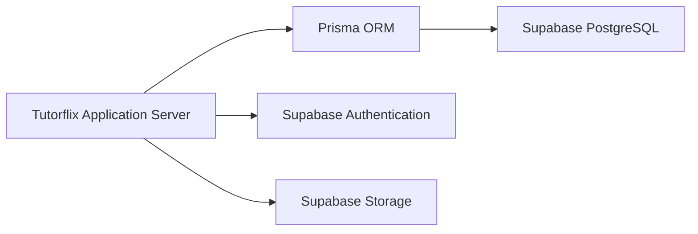
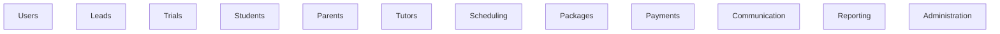
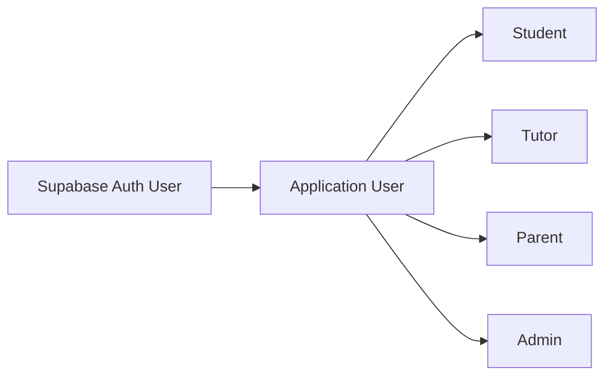

# 06. Database Architecture

## Purpose

This document defines the database architecture of the Tutorflix platform.

The platform uses **Supabase PostgreSQL** as its primary relational database. Data is organized using a normalized relational model designed to ensure consistency, maintainability, scalability, and efficient querying.

Authentication is handled separately through **Supabase Authentication**, while all business data is stored within PostgreSQL.

---

# Database Technology

| Component | Technology |
|------------|------------|
| Database Engine | PostgreSQL |
| Database Platform | Supabase |
| ORM | Prisma |
| Migration Tool | Prisma Migrate |
| Authentication | Supabase Auth |

---

# Architecture Overview



---

# Database Design Principles

The database follows the following principles.

## Normalization

Business data is normalized to reduce redundancy and maintain consistency.

Most tables follow Third Normal Form (3NF).

---

## Single Source of Truth

Each business entity is stored once.

Examples

- Student information exists only in Student tables.
- Tutor information exists only in Tutor tables.
- Package balances are derived from transactions rather than duplicated.

---

## Referential Integrity

Relationships are enforced using foreign keys.

Examples

- A Class must reference an existing Tutor.
- A Package must reference an existing Student.
- A Payment must reference an existing Package.

---

## Soft Deletes

Business records are never permanently deleted.

Instead they contain fields such as

```text
deleted_at
deleted_by
```

This allows:

- Audit history
- Data recovery
- Reporting accuracy

---

## Auditability

Important business actions are logged.

Examples

- Lead converted
- Package changed
- Payment approved
- Tutor assigned
- Message deleted

Audit logs are stored separately from business data.

---

# Database Layers

The database is organized into logical business areas.



Each business domain owns its own tables.

---

# Authentication Model

Tutorflix separates authentication from business data.



Authentication information includes:

- Email
- Password
- Sessions

Business information includes:

- Profile
- Role
- Status
- Preferences

---

# Data Ownership

Each domain owns its own data.

| Domain | Primary Data |
|----------|--------------|
| Users | User accounts, roles |
| Leads | Leads, follow-ups |
| Trials | Trial classes |
| Students | Student profiles |
| Parents | Parent profiles |
| Tutors | Tutor profiles |
| Scheduling | Classes, calendars |
| Packages | Lesson packages |
| Payments | Transactions |
| Communication | Conversations, messages |
| Administration | Audit logs, settings |

No domain writes directly to another domain's tables except through business services.

---

# Transaction Management

Database transactions are used for operations affecting multiple entities.

Examples

- Lead → Student conversion
- Payment approval
- Tutor assignment
- Package activation
- Class cancellation

Transactions ensure all related changes succeed or fail together.

---

# Indexing Strategy

Indexes are created on frequently queried fields.

Examples

- Email
- User ID
- Student ID
- Tutor ID
- Lead Status
- Trial Status
- Class Date
- Package Status
- Payment Status
- Conversation ID

Composite indexes are used where appropriate to improve query performance.

---

# File Storage

Binary files are not stored in PostgreSQL.

Files are stored using Supabase Storage.

Examples

- Payment receipts
- Profile pictures
- Learning resources
- Assignment attachments

The database stores only file metadata and storage paths.

---

# Realtime Data

Supabase Realtime is used for:

- Chat messages
- Notifications
- Live dashboard updates

Persistent data is still stored within PostgreSQL.

Realtime events never replace permanent database records.

---

# Data Security

The platform protects data using multiple layers.

## Authentication

Managed through Supabase Authentication.

---

## Authorization

Handled by the Application Server using RBAC.

---

## Validation

All incoming data is validated before reaching the database.

---

## Encryption

Sensitive communication occurs over HTTPS.

Passwords are never stored within application tables.

Supabase manages password hashing.

---

# Backup and Recovery

Supabase provides managed backups and recovery.

Additional recommendations:

- Daily automated backups
- Point-in-time recovery
- Migration versioning using Prisma
- Regular backup verification

---

# Performance Considerations

The database is optimized using:

- Proper indexing
- Foreign keys
- Normalization
- Transactions
- Efficient joins
- Query optimization through Prisma

Business logic is intentionally kept outside SQL to simplify maintenance.

---

# Future Improvements

The database architecture supports future additions without redesign.

Possible enhancements include:

- Read replicas
- Redis caching
- Full-text search
- Analytics warehouse
- Data archiving
- Multi-region deployment

---

# Design Decisions

- PostgreSQL is the primary relational database.
- Supabase provides managed database infrastructure.
- Prisma is the exclusive ORM.
- Authentication is separated from business data.
- Business data is normalized.
- Soft deletes are preferred over hard deletes.
- Files are stored in Supabase Storage.
- Business logic is implemented in the Application Server rather than database procedures.
- Every domain owns its own data while maintaining referential integrity.

---

# Related Documents

- 04-domain-architecture.md
- 05-backend-architecture.md
- 06-database-erd.md
- 07-authentication-rbac.md
