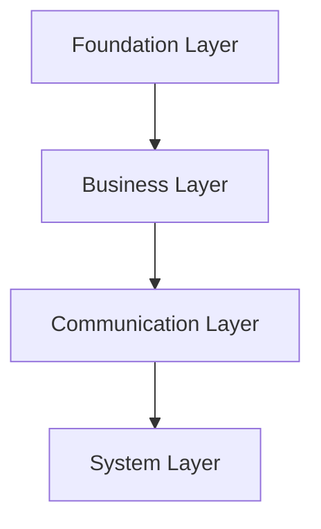
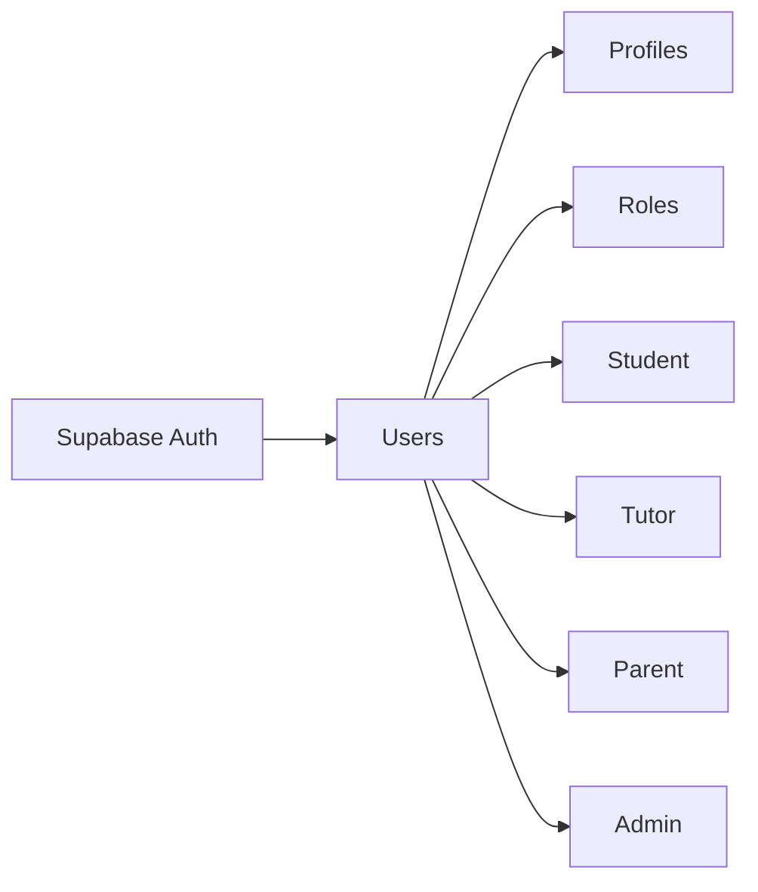
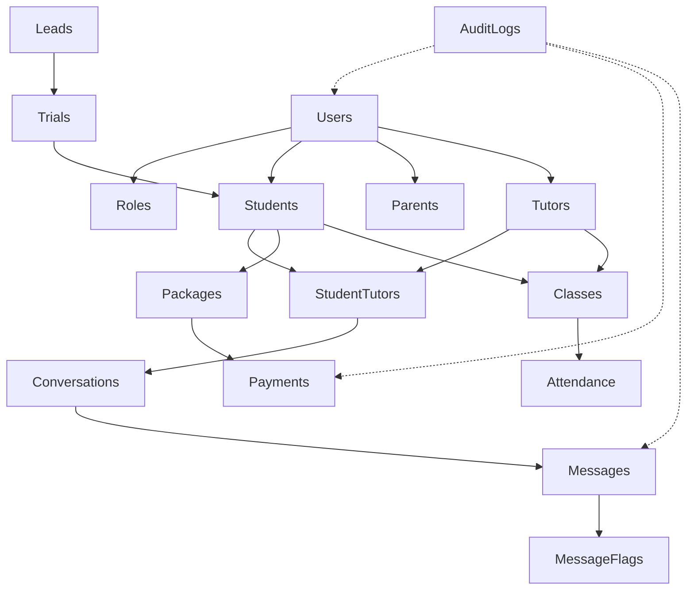

# 07. Database Model

## Purpose

This document defines the conceptual data model of the Tutorflix platform.

The database model identifies the primary business entities, their ownership, and their relationships before implementation.

Rather than focusing on columns or SQL definitions, this document describes the purpose and responsibility of each table within the overall system architecture.

---

# Database Model Overview

The Tutorflix database is organized into four logical layers.



Each layer groups related entities while maintaining clear separation of concerns.

---

# Foundation Layer

The Foundation Layer provides the core identity and authorization model used by every other domain.

## Entities

| Entity | Purpose |
|---------|---------|
| Users | Central application identity |
| User Profiles | Shared personal information |
| Roles | System roles |
| Permissions | Individual permissions |
| Role Permissions | Maps permissions to roles |
| User Roles | Assigns roles to users |

---

## User Model

Tutorflix separates authentication from application data.



A user may possess multiple roles.

Examples:

- Tutor + Admin
- Parent + Tutor
- Admin + Head of Department

---

# Business Layer

The Business Layer contains the operational entities of the tutoring platform.

## Lead Management

Entities

- Leads
- Lead Activities
- Lead Notes

Purpose

Tracks prospective students from initial inquiry through conversion.

---

## Trial Management

Entities

- Trials
- Trial Feedback

Purpose

Manages introductory trial lessons before enrollment.

---

## Student Management

Entities

- Students

Purpose

Stores academic information for enrolled students.

---

## Parent Management

Entities

- Parents

Purpose

Maintains parent or guardian information.

---

## Tutor Management

Entities

- Tutors
- Tutor Availability

Purpose

Maintains tutor information, qualifications, and available schedules.

Tutors are modeled as independent contractors.

---

## Student–Tutor Relationship

Rather than embedding tutor references throughout the system, Tutorflix models tutor assignments explicitly.

Entity

- Student Tutors

Responsibilities

- Current tutor
- Previous tutor history
- Temporary replacements
- Primary tutor designation

```text
Student

↓

Student Tutor Assignment

↓

Tutor
```

---

## Scheduling

Entities

- Classes
- Class Requests
- Attendance

Purpose

Manages lesson scheduling and attendance.

Supports

- Student requests
- Parent requests
- Tutor approval
- Admin scheduling

---

## Package Management

Entities

- Packages
- Package Usage

Purpose

Tracks purchased lesson hours and remaining balances.

---

## Payment Management

Entities

- Payments

Purpose

Tracks payment verification and package activation.

Current provider

- Manual Verification

Future providers

- Stripe
- PayPal
- Local Payment Gateway

---

# Communication Layer

The Communication Layer manages conversations, notifications, and message moderation.

---

## Conversations

Entity

- Conversations

Purpose

Represents one conversation between a Student and Tutor.

One Student–Tutor pair has one conversation regardless of the number of classes or subjects.

---

## Conversation Participants

Entity

- Conversation Participants

Purpose

Tracks users participating in conversations.

Possible participants

- Student
- Parent
- Tutor
- Admin

---

## Messages

Entity

- Messages

Purpose

Stores conversation history.

Messages are never permanently deleted.

Soft deletion is used instead.

---

## Message Moderation

Entities

- Message Flags

Purpose

Stores moderation events.

Examples

- Phone Number
- Email
- URL
- Profanity
- Payment Discussion
- AI Flag (Future)

---

## Notifications

Entity

- Notifications

Purpose

Stores in-app notifications delivered to users.

Examples

- Upcoming class
- Trial reminder
- Payment approved
- Tutor assignment

---

# System Layer

The System Layer contains platform-wide operational entities.

---

## Audit Logs

Entity

- Audit Logs

Purpose

Records important business events.

Examples

- User created
- Lead converted
- Package updated
- Message deleted
- Payment approved

---

## Settings

Entity

- Settings

Purpose

Stores configurable platform settings.

Examples

- Academic policies
- Default lesson duration
- Working hours
- Notification settings

---

## File Uploads

Entity

- File Uploads

Purpose

Stores metadata for files kept in Supabase Storage.

Examples

- Payment receipts
- Profile pictures
- Learning resources

---

# Domain Ownership

| Domain | Primary Entities |
|---------|------------------|
| Authentication | Supabase Auth |
| Users | Users, User Profiles, Roles |
| Leads | Leads, Lead Activities, Lead Notes |
| Trials | Trials, Trial Feedback |
| Students | Students |
| Parents | Parents |
| Tutors | Tutors, Tutor Availability |
| Scheduling | Class Requests, Classes, Attendance |
| Packages | Packages, Package Usage |
| Payments | Payments |
| Communication | Conversations, Participants, Messages, Message Flags, Notifications |
| Administration | Audit Logs, Settings, File Uploads |

---

# High-Level Relationships



---

# Data Ownership Principles

The database follows these ownership rules.

- Every entity belongs to a single domain.
- Business logic owns relationships rather than the database.
- Soft deletion is preferred over permanent deletion.
- Audit history is preserved.
- Files are stored in Supabase Storage; only metadata is stored in PostgreSQL.
- Authentication data is isolated within Supabase Auth.

---

# Future Expansion

The model supports future enhancements including:

- Mobile applications
- AI tutoring assistant
- Multiple payment providers
- Homework management
- Learning resources
- Tutor payroll
- Certificates
- Assessments
- Multi-language support

These additions can be introduced without redesigning the existing data model.

---

# Design Decisions

- A single User identity is shared across all domains.
- Role-specific data is separated into dedicated profile entities.
- Student–Tutor assignments are modeled explicitly.
- Conversations are based on Student–Tutor relationships rather than classes.
- Payments use a provider-independent model.
- Soft deletion is used for business records.
- Audit logs provide complete traceability.
- Business entities are organized into Foundation, Business, Communication, and System layers.

---

# Related Documents

- 04-domain-architecture.md
- 05-backend-architecture.md
- 06-database-architecture.md
- 08-foundation-erd.md
- 09-business-erd.md
- 10-communication-erd.md
- 11-system-erd.md
