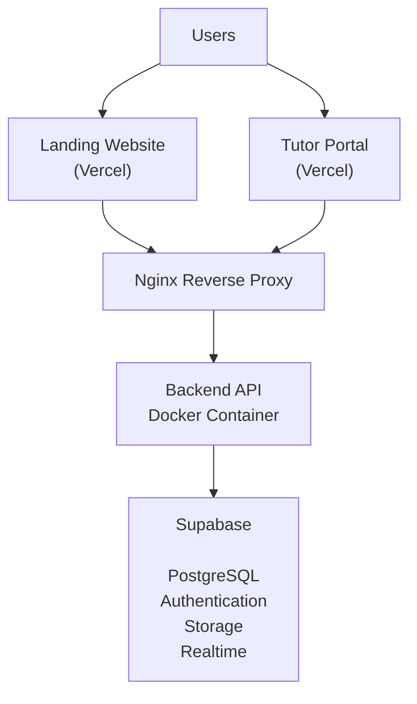
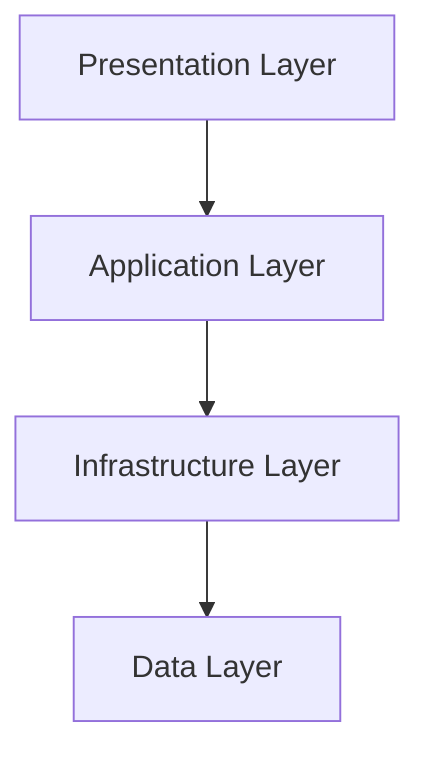

# 17. Deployment Architecture

## Purpose

This document defines the deployment architecture of the Tutorflix platform.

The deployment architecture separates presentation, application, and data layers to improve scalability, security, and maintainability.

Tutorflix consists of two independent frontend applications, one backend application, and managed cloud infrastructure.

---

# Deployment Overview



---

# Deployment Components

| Component | Technology |
|------------|------------|
| Landing Website | React + Vite |
| Portal | React + Vite |
| Frontend Hosting | Vercel |
| Backend | Node.js + Express |
| Containerization | Docker |
| Reverse Proxy | Nginx |
| Database | Supabase PostgreSQL |
| Authentication | Supabase Auth |
| Storage | Supabase Storage |
| Realtime | Supabase Realtime |
| SSL | Let's Encrypt |
| CI/CD | GitHub Actions |

---

# Infrastructure Layers



---

# Presentation Layer

Contains the two frontend applications.

### Landing Website

Responsibilities

- Marketing pages
- Contact forms
- Pricing
- About
- Lead generation

---

### Portal

Responsibilities

- Admin Portal
- Student Portal
- Parent Portal
- Tutor Portal
- Staff Portal

Both applications communicate with the same backend API.

---

# Application Layer

The backend is deployed as a Docker container.

Responsibilities

- Business logic
- Authentication
- Authorization
- Validation
- Scheduling
- Chat
- Payments
- Reporting

The backend exposes REST APIs consumed by both frontend applications.

---

# Reverse Proxy

Nginx acts as the public entry point.

Responsibilities

- HTTPS termination
- Reverse proxy
- Load balancing (future)
- Compression
- Static caching
- Security headers

Example

```text
Internet

↓

Nginx

↓

Backend Container
```

---

# Data Layer

Supabase provides managed infrastructure.

Services used:

- PostgreSQL
- Authentication
- Storage
- Realtime

Business logic remains inside the backend application.

---

# Container Architecture

```mermaid
flowchart LR

Docker

-->

Node.js

-->

Express API

-->

Prisma

-->

Supabase
```

The Docker container packages the backend application with all runtime dependencies.

---

# Network Architecture

```mermaid
flowchart LR

Browser

-->

HTTPS

-->

Nginx

-->

Backend API

-->

Supabase
```

Only HTTPS traffic is accepted.

---

# Domain Architecture

Example production domains

```text
www.tutorflix.com

↓

Landing Website

--------------------

portal.tutorflix.com

↓

Portal

--------------------

api.tutorflix.com

↓

Backend API
```

---

# SSL

HTTPS is enforced for all public traffic.

Certificates are managed using Let's Encrypt.

---

# Environment Configuration

Application secrets are stored using environment variables.

Examples

- Database URL
- Supabase URL
- Supabase Service Key
- JWT Secret
- SMTP Credentials
- Microsoft Teams API Keys

Secrets are never committed to source control.

---

# CI/CD Pipeline

```mermaid
flowchart LR

Developer

-->

GitHub

-->

GitHub Actions

-->

Build

-->

Tests

-->

Deploy

-->

Production
```

Deployment occurs automatically after successful builds.

---

# Monitoring (Future)

Recommended additions

- Grafana
- Prometheus
- Sentry
- Uptime Monitoring

These services provide visibility into application health and errors.

---

# Backup Strategy

Database

- Managed by Supabase
- Automated backups
- Point-in-time recovery

Files

- Stored in Supabase Storage
- Regular backup policy

Application

- Source code maintained in GitHub repositories

---

# Scalability

The deployment architecture supports future scaling.

Possible upgrades include:

- Multiple backend containers
- Nginx load balancing
- Redis caching
- Background job workers
- CDN integration
- Kubernetes orchestration

No architectural redesign is required for these enhancements.

---

# Design Decisions

- Frontend applications are deployed independently.
- The backend is containerized using Docker.
- Nginx serves as the reverse proxy.
- Supabase provides managed database, authentication, storage, and realtime services.
- Business logic remains exclusively within the backend.
- HTTPS is enforced across all services.
- CI/CD automates the deployment process.
- The architecture is designed to scale horizontally as platform usage grows.

---

# Related Documents

- 05-backend-architecture.md
- 06-database-architecture.md
- 13-authentication-architecture.md
- 15-api-architecture.md
- 16-frontend-architecture.md
