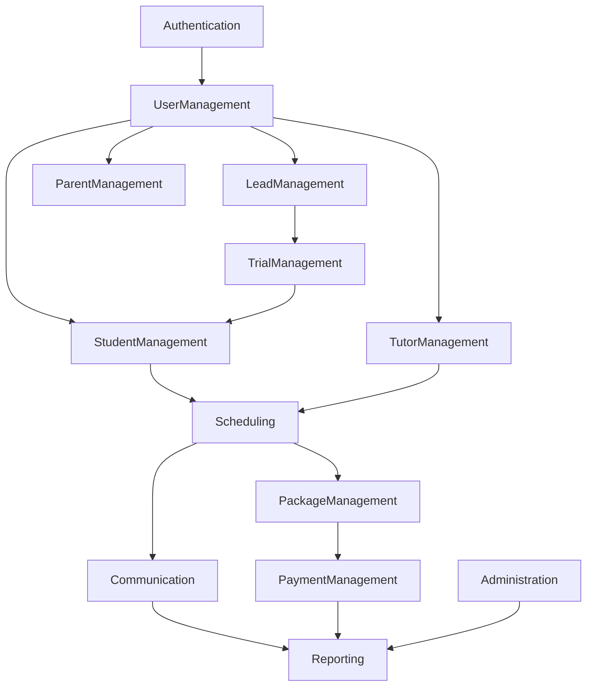

# 04. Domain Architecture

## Purpose

This document defines the business domains of the Tutorflix platform and the responsibilities assigned to each domain.

The purpose of the Domain Architecture is to organize the system around business capabilities instead of technical layers. Each domain encapsulates its own business rules, services, APIs, validation, and data access while collaborating with other domains through well-defined interfaces.

This approach improves maintainability, scalability, and separation of concerns by ensuring that each domain is responsible for a single business area.

---

# Architecture Principles

The platform follows these principles:

- High Cohesion
- Low Coupling
- Single Responsibility
- Modular Design
- API First
- RBAC Driven
- Centralized Business Logic
- Shared User Identity

Every feature belongs to one domain.

A domain owns:

- Business Rules
- Services
- Validation
- Database Access
- REST APIs

---

# High-Level Domain Architecture



---

# Domain Overview

| Domain | Responsibility |
|---------|---------------|
| Authentication | User authentication and sessions |
| User Management | User identity, roles, profiles |
| Lead Management | Lead lifecycle |
| Trial Management | Trial scheduling and outcomes |
| Student Management | Student lifecycle |
| Parent Management | Parent profiles and student relationships |
| Tutor Management | Tutor lifecycle and availability |
| Scheduling | Class scheduling and conflict detection |
| Package Management | Lesson packages and remaining hours |
| Payment Management | Payments and verification |
| Communication | Chat and notifications |
| Reporting | Analytics and dashboards |
| Administration | System configuration and audit logs |

---

# Domain Details

## Authentication Domain

### Purpose

Responsible for authentication.

### Responsibilities

- Login
- Logout
- Password Reset
- Session Validation
- JWT Verification
- MFA (Future)

### External Dependency

- Supabase Auth

---

## User Management Domain

### Purpose

Maintains the application's user identity.

A User is the central identity used throughout the platform.

Role-specific information is stored separately.

### Responsibilities

- User Accounts
- User Status
- Roles
- Permissions
- Profile Assignment

### Roles

- Student
- Parent
- Tutor
- Admin
- Admin Manager
- Intro Scheduler
- Sales Team
- Head of Department
- Stakeholder

---

## Lead Management Domain

### Purpose

Manages the lifecycle of prospective students.

### Responsibilities

- Lead Creation
- Lead Assignment
- Follow-ups
- Lead Notes
- Lead Activities
- Lead Status
- Conversion

### Lead Lifecycle

```text
New

↓

Contacted

↓

Follow Up

↓

Trial Booked

↓

Converted

or

Lost
```

---

## Trial Management Domain

### Purpose

Manages trial lessons.

### Responsibilities

- Trial Scheduling
- Tutor Assignment
- Trial Feedback
- Trial Outcome
- Trial Rescheduling

### Outputs

Successful trials can create Students.

---

## Student Management Domain

### Purpose

Maintains enrolled students.

### Responsibilities

- Student Profile
- Enrollment
- Subjects
- Curriculum
- Academic Information
- Assigned Tutor
- Progress

---

## Parent Management Domain

### Purpose

Maintains parent information.

### Responsibilities

- Parent Profile
- Linked Students
- Contact Information
- Payment History
- Communication

---

## Tutor Management Domain

### Purpose

Manages independent tutors.

Tutors are treated as independent contractors rather than employees.

### Responsibilities

- Tutor Profile
- Qualifications
- Subjects
- Availability
- Performance Metrics
- Activation
- Deactivation

---

## Scheduling Domain

### Purpose

Responsible for all class scheduling.

### Responsibilities

- Student Requests
- Parent Requests
- Tutor Approval
- Admin Scheduling
- Tutor Scheduling
- Conflict Detection
- Rescheduling
- Calendar

### Scheduling Flow

```text
Student Request

↓

Tutor Approval

↓

Class Scheduled
```

or

```text
Parent Request

↓

Tutor Approval

↓

Class Scheduled
```

or

```text
Admin Creates Class
```

---

## Package Management Domain

### Purpose

Tracks purchased lesson packages.

### Responsibilities

- Package Creation
- Remaining Hours
- Consumed Hours
- Expiration
- Usage History

---

## Payment Management Domain

### Purpose

Handles tuition payments.

### Current Provider

Manual Verification

### Future Providers

- Stripe
- PayPal
- Local Payment Gateways

The Payment Domain is provider-based so additional gateways can be integrated without affecting other domains.

### Current Flow

```text
Parent

↓

Upload Receipt

↓

Admin Verification

↓

Activate Package
```

---

## Communication Domain

### Purpose

Provides communication between platform participants.

### Responsibilities

- Chat
- Notifications
- Announcements
- Message Moderation

### Conversation Model

One conversation exists per Student–Tutor relationship.

Regardless of the number of classes or subjects taught by the tutor, the same conversation is reused.

Participants may include:

- Student
- Tutor
- Parent
- Admin

---

### Message Processing Pipeline

```text
User Sends Message

↓

Validation

↓

Moderation Service

↓

Phone Detection

↓

Email Detection

↓

URL Detection

↓

Profanity Detection

↓

AI Moderation (Future)

↓

Conversation Flags

↓

Save Message

↓

Realtime Broadcast
```

---

### Conversation Flags

Supported flags include:

- Phone Number
- Email Address
- External URL
- Profanity
- Payment Discussion
- Suspicious Behaviour
- Tutor Response Delay
- Student Inactivity
- Custom Flag

Flags appear inside the Admin Moderation Dashboard.

---

### Message Deletion Policy

Messages are never permanently deleted.

Instead they are soft deleted.

Admins can always view:

- Original Message
- Deleted By
- Deleted At
- Delete Reason

---

## Reporting Domain

### Purpose

Provides operational and business insights.

### Responsibilities

- KPI Dashboards
- Revenue Reports
- Tutor Performance
- Student Progress
- Lead Conversion
- Trial Success
- Scheduling Statistics

---

## Administration Domain

### Purpose

Responsible for platform administration.

### Responsibilities

- User Management
- RBAC Configuration
- System Settings
- Audit Logs
- Moderation Dashboard
- Feature Flags (Future)

---

# Domain Dependencies

```text
Authentication
        │
        ▼
User Management
        │
        ├───────────────┐
        ▼               ▼
Lead Management     Tutor Management
        │               │
        ▼               ▼
Trial Management   Scheduling
        │               ▲
        ▼               │
Student Management ──────┘
        │
        ▼
Package Management
        │
        ▼
Payment Management
        │
        ▼
Communication
        │
        ▼
Reporting
        │
        ▼
Administration
```

---

# Design Decisions

- Business logic is organized by domain instead of technical layers.
- Each domain owns its own services, validation, and APIs.
- CRM functionality is implemented as Lead and Trial Management within the Admin Portal rather than as a separate module.
- Tutors are modeled as independent contractors.
- Chat is centered on the Student–Tutor relationship rather than individual classes.
- Payments use a provider-based architecture to support future gateway integrations.
- Message moderation and conversation flags are built into the Communication Domain from the outset.
- Domains collaborate through the Application Server and do not communicate directly with the database.

---

# Related Documents

- 05-backend-architecture.md
- 06-database-architecture.md
- 07-authentication-rbac.md
- 10-api-architecture.md
