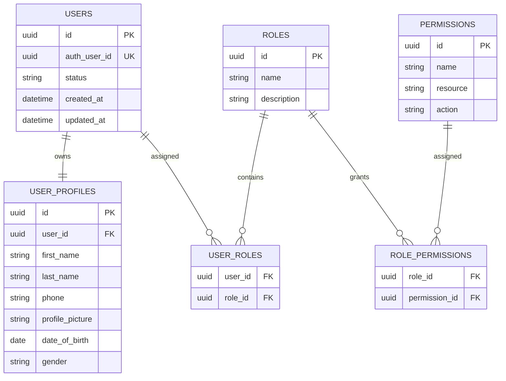

# 08. Foundation ERD

## Purpose

This document defines the core identity and authorization entities of the Tutorflix platform.

The Foundation Layer provides authentication, user identity, roles, and permissions used throughout the application.

Authentication credentials are managed by Supabase Authentication, while application-specific user data is stored in PostgreSQL.

---

# Entity Relationship Diagram

---

# Entity Responsibilities

## Users

Represents the application's central identity.

A user can possess multiple roles.

Examples

- Student
- Parent
- Tutor
- Admin
- Head of Department

---

## User Profiles

Stores shared profile information.

Business-specific information is stored in dedicated domain tables.

---

## Roles

Defines user roles used by RBAC.

Examples

- Student
- Parent
- Tutor
- Admin
- Admin Manager
- Intro Scheduler
- Sales Team
- Head of Department
- Stakeholder

---

## Permissions

Represents granular actions within the platform.

Examples

- student.read
- student.update
- payment.verify
- report.view

---

## User Roles

Supports many-to-many relationships between users and roles.

A user may hold multiple roles simultaneously.

---

## Role Permissions

Maps permissions to roles.

Authorization is evaluated by the backend using these mappings.

---

# Design Decisions

- Authentication remains managed by Supabase Auth.
- Users are the central identity for the application.
- RBAC supports multiple roles per user.
- Permissions are assigned through roles rather than directly to users.
