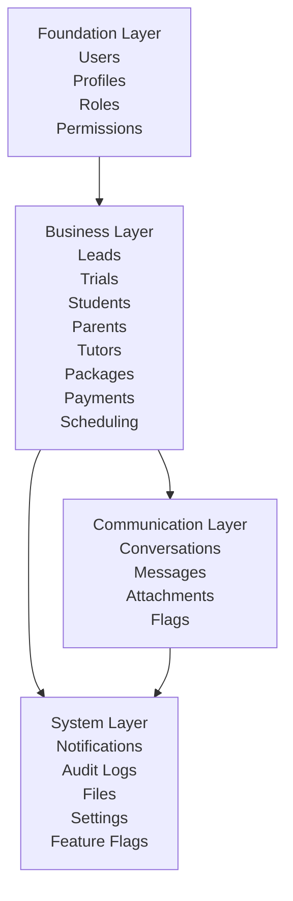
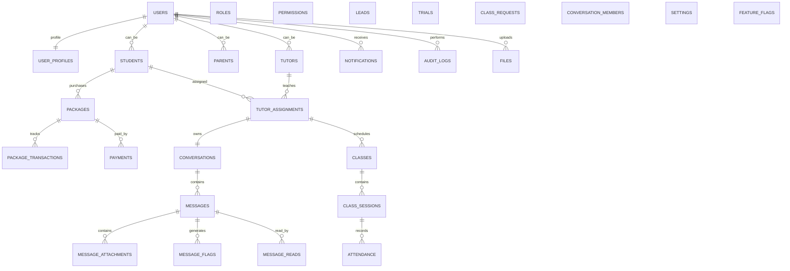
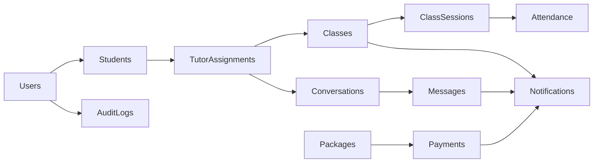

# 12. Master ERD

## Purpose

This document provides a high-level overview of the Tutorflix database.

Unlike the detailed ERDs, the Master ERD illustrates how the major database domains relate to one another without exposing implementation details.

It serves as the primary architectural reference for understanding the overall data model.

---

# Database Overview

The Tutorflix database is organized into four logical layers.



---

# Master Entity Relationship Diagram



---

# Database Domains

## Foundation

Responsible for authentication and authorization.

### Entities

- Users
- User Profiles
- Roles
- Permissions
- User Roles
- Role Permissions

Responsibilities

- Identity
- RBAC
- User Profiles

---

## Business

Responsible for academy operations.

### Entities

- Leads
- Trials
- Students
- Parents
- Tutors
- Tutor Assignments
- Tutor Availability
- Subjects
- Student Subjects
- Tutor Subjects
- Class Requests
- Classes
- Class Sessions
- Attendance
- Packages
- Package Transactions
- Payments

Responsibilities

- Student lifecycle
- Scheduling
- Payments
- Lesson tracking

---

## Communication

Responsible for platform messaging.

### Entities

- Conversations
- Conversation Members
- Messages
- Message Attachments
- Message Flags
- Message Reads

Responsibilities

- Chat
- Moderation
- Attachments
- Read receipts

---

## System

Shared infrastructure used by all domains.

### Entities

- Notifications
- Audit Logs
- Files
- Settings
- Feature Flags

Responsibilities

- Notifications
- Auditing
- Configuration
- File metadata
- Feature management

---

# Cross-Domain Relationships



---

# System Workflow

```mermaid
flowchart TD

Lead

-->

Trial

-->

Student

-->

Package Purchase

-->

Payment Verification

-->

Tutor Assignment

-->

Class Scheduling

-->

Class Session

-->

Attendance

-->

Package Transaction

Tutor Assignment

-->

Conversation

Conversation

-->

Messages

Messages

-->

Moderation

Moderation

-->

Notifications
```

---

# Database Design Principles

The Tutorflix database follows these architectural principles.

## Domain Ownership

Every entity belongs to exactly one business domain.

---

## Separation of Concerns

Business logic is implemented in the application layer rather than the database.

---

## Referential Integrity

Relationships are enforced through foreign keys.

---

## Soft Deletion

Business records are retained for auditing whenever appropriate.

---

## Auditability

Important business events are permanently logged.

---

## Scalability

The database model supports future expansion without major redesign.

Examples include:

- Stripe
- PayPal
- AI Moderation
- WhatsApp Integration
- Mobile Applications
- Analytics
- Tutor Payroll
- Homework Management

---

# Related Documents

- 08-foundation-erd.md
- 09-business-erd.md
- 10-communication-erd.md
- 11-system-erd.md
