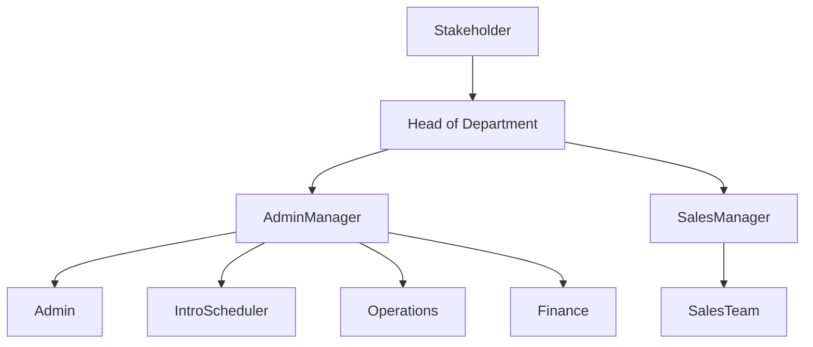
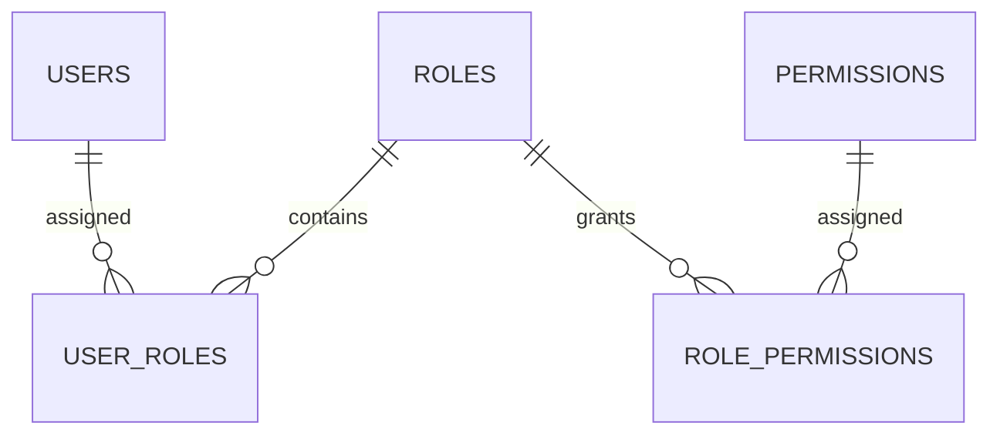

# 14. RBAC Architecture

## Purpose

This document defines the Role-Based Access Control (RBAC) architecture of the Tutorflix platform.

RBAC determines what authenticated users are allowed to access and perform within the system. Permissions are assigned to roles, and roles are assigned to users.

This architecture enables secure access control while allowing new roles and permissions to be added without changing the application's core logic.

---

# RBAC Overview

```mermaid
flowchart LR

User

-->

Authentication

-->

User Roles

-->

Permissions

-->

RBAC Middleware

-->

Protected Resource
```

---

# Organizational Structure



---

# User Roles

The platform supports the following roles.

| Role | Description |
|------|-------------|
| Stakeholder | System owner with complete visibility |
| Head of Department | Oversees all departments |
| Admin Manager | Manages administration staff |
| Admin | General administration |
| Intro Scheduler | Manages trial scheduling |
| Sales Manager | Manages sales department |
| Sales Team | Handles leads and conversions |
| Operations | Daily operational activities |
| Finance | Payments and financial records |
| Tutor | Conducts lessons |
| Student | Attends classes |
| Parent | Monitors student progress |

---

# Permission Model

Permissions follow the format:

```text
resource.action
```

Examples:

```text
student.read
student.create
student.update

tutor.read
tutor.update

lead.read
lead.assign
lead.convert

trial.schedule

class.schedule
class.update
class.cancel

payment.read
payment.verify

package.create
package.update

chat.send
chat.read
chat.monitor
chat.delete

report.view
report.export

settings.update
```

---

# RBAC Flow

```mermaid
flowchart LR

Request

-->

JWT Verified

-->

Load User

-->

Load Roles

-->

Load Permissions

-->

Permission Check

-->

Allowed

-->

Controller

-->

Service
```

If permission is denied:

```
403 Forbidden
```

---

# Permission Assignment



---

# Module Permissions

## Leads

- lead.read
- lead.create
- lead.update
- lead.assign
- lead.convert

---

## Trials

- trial.read
- trial.schedule
- trial.update
- trial.cancel

---

## Students

- student.read
- student.create
- student.update
- student.archive

---

## Tutors

- tutor.read
- tutor.create
- tutor.update
- tutor.activate
- tutor.deactivate

---

## Scheduling

- class.read
- class.schedule
- class.update
- class.cancel

---

## Packages

- package.read
- package.create
- package.update

---

## Payments

- payment.read
- payment.verify
- payment.reject

---

## Communication

- chat.read
- chat.send
- chat.monitor
- chat.delete

---

## Reports

- report.view
- report.export

---

## Administration

- settings.read
- settings.update
- user.manage
- role.manage
- permission.manage

---

# Authorization Principles

The platform follows these principles:

- Every request requires authentication.
- Every protected action requires permission.
- Permissions are assigned through roles.
- Users may have multiple roles.
- Roles may contain multiple permissions.
- Authorization is enforced by backend middleware.
- Frontend permission checks are for user experience only and do not replace backend authorization.

---

# Design Decisions

- RBAC is database-driven.
- Roles and permissions are managed independently.
- Users can hold multiple roles simultaneously.
- Permissions are evaluated on every protected request.
- Authorization is enforced before business logic execution.
- New roles and permissions can be added without modifying application code.

---

# Related Documents

- 13-authentication-architecture.md
- 08-foundation-erd.md
- 15-api-architecture.md
