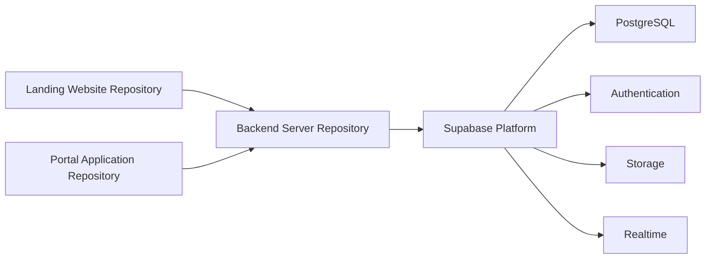
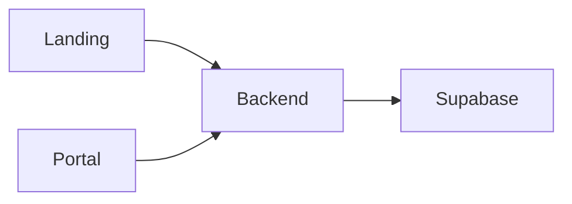

# 02. Repository Architecture

## Purpose

This document describes how the Tutorflix platform is organized across multiple source code repositories.

Rather than using a monorepo, Tutorflix follows a multi-repository architecture where each major application is maintained independently while communicating through a centralized backend.

This separation allows each application to be developed, tested, deployed, and versioned independently.

---

# Architecture Overview

---

# Repository Structure

The platform consists of three primary repositories.

| Repository | Technology | Responsibility |
|------------|------------|----------------|
| Landing Website | Next.js | Marketing website |
| Portal Application | Next.js | Authenticated user portals |
| Backend Server | Express.js | Business logic and APIs |

---

# Landing Website Repository

## Purpose

Provides the public-facing website for Tutorflix.

### Responsibilities

- Marketing pages
- SEO
- Trial booking
- Contact forms
- Public tutor information
- Public curriculum information
- Blog (Future)

### Does NOT contain

- Authentication
- Business logic
- Database access
- Scheduling
- Dashboards

---

# Portal Application Repository

## Purpose

Provides authenticated access to the Tutorflix platform.

This repository contains all role-specific interfaces.

### User Portals

- Student Portal
- Parent Portal
- Tutor Portal
- Admin Portal

Access to functionality is controlled through RBAC.

### Responsibilities

- User interface
- Dashboard
- Forms
- API consumption
- Session management
- Client-side validation

### Does NOT contain

- Business rules
- Database access
- Payment processing
- Scheduling logic

---

# Backend Server Repository

## Purpose

Acts as the central application server for Tutorflix.

All business logic is executed within this repository.

### Responsibilities

- REST APIs
- Authentication validation
- RBAC
- Business rules
- Scheduling
- Lead conversion
- Payment verification
- Notifications
- Microsoft Teams integration
- Chat moderation
- Reporting

The Backend Server is the only application allowed to communicate directly with Supabase.

---

# Repository Communication

Repositories never communicate directly with each other.

All communication flows through the Backend Server.

---

# Shared Resources

Although repositories are independent, they share common standards.

## Shared Components

The following should remain synchronized across repositories:

- API specification
- Database schema
- Environment variable naming
- Authentication strategy
- Coding standards
- Error response format

---

# Branching Strategy

Each repository maintains its own Git history.

Recommended branches:

- main
- development
- feature/*
- hotfix/*
- release/*

---

# Deployment Independence

Each repository can be deployed independently.

| Repository | Deployment |
|------------|------------|
| Landing Website | Vercel |
| Portal Application | Vercel |
| Backend Server | Docker |
| Database | Supabase Cloud |

Independent deployments allow frontend updates without redeploying the backend and vice versa.

---

# Advantages

This architecture provides:

- Independent deployments
- Clear separation of concerns
- Smaller repositories
- Faster CI/CD pipelines
- Independent versioning
- Easier onboarding for developers

---

# Trade-offs

Compared to a monorepo, this approach introduces:

- Duplicate UI components across frontends
- Separate dependency management
- Independent release cycles
- Additional coordination for shared types and API contracts

These trade-offs are acceptable because the Landing Website and Portal Application have distinct responsibilities and evolve at different rates.

---

# Design Decisions

- Landing Website and Portal Application are maintained in separate repositories.
- All business logic resides in the Backend Server.
- Frontends never communicate directly with Supabase.
- The Backend Server is the single source of truth for application data and business rules.
- Repository separation enables independent deployment and scaling.

---

# Related Documents

- 01-system-context.md
- 03-application-architecture.md
- 05-backend-architecture.md
