# 18. Sequence Diagrams

## Purpose

This document describes the sequence of interactions between users, frontend applications, backend services, and infrastructure for the core business processes of the Tutorflix platform.

---

# Table of Contents

1. User Authentication
2. Lead Creation
3. Trial Scheduling
4. Lead Conversion
5. Student Package Purchase
6. Class Request
7. Class Scheduling
8. Join Class
9. Attendance Recording
10. Package Hour Deduction
11. Chat Messaging
12. Chat Moderation
13. Manual Payment Verification
14. Tutor Assignment
15. Notification Flow

---
## User Authentication

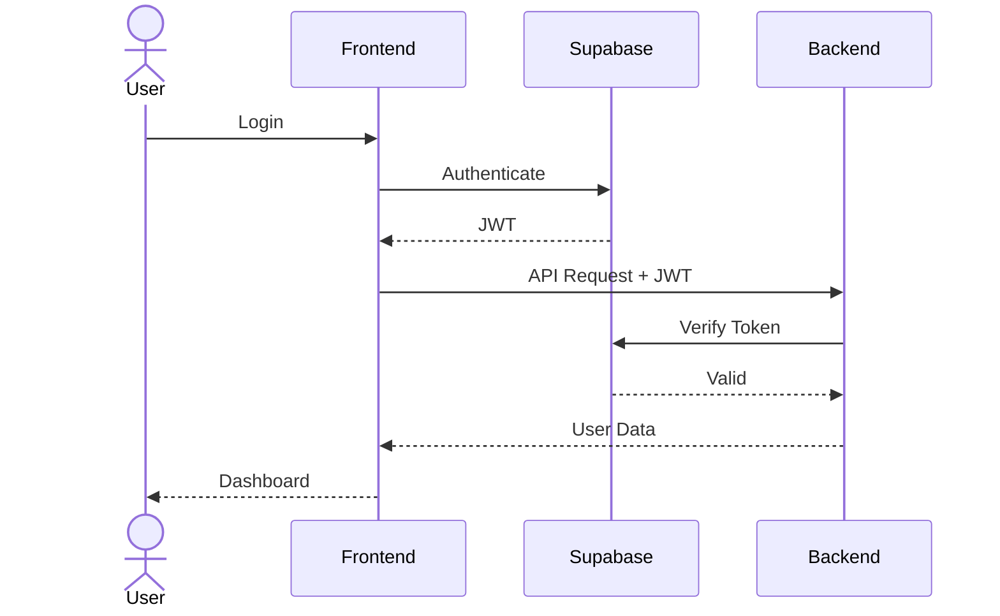
## Lead Creation

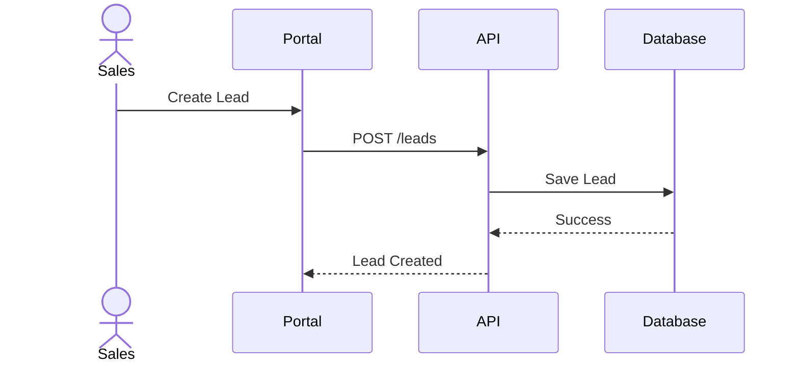
## Trial Scheduling

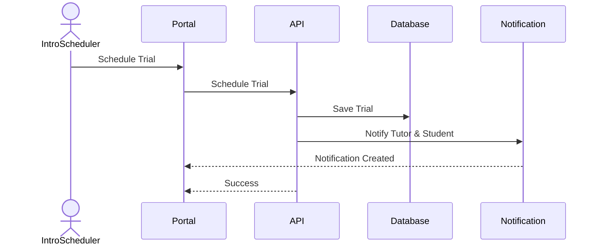
## Lead Conversion

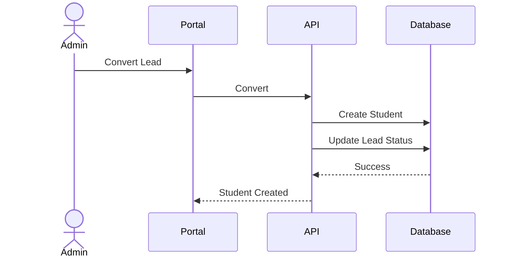
## Package Purchase

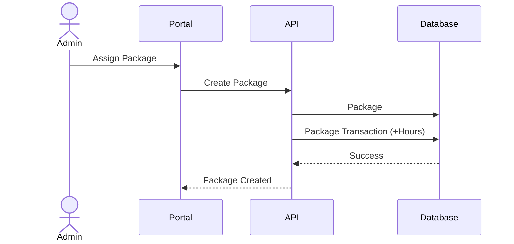
## Manual Payment Verification

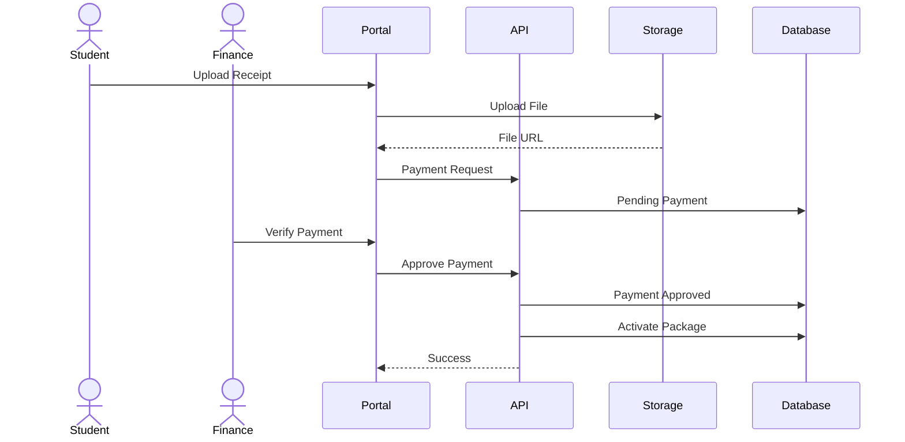
## Tutor Assignment

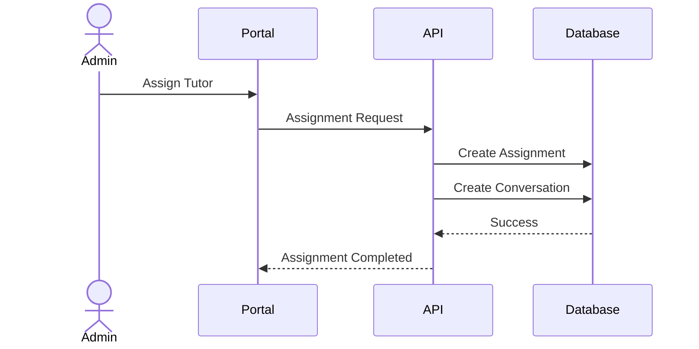
## Class Request

## Class Scheduling

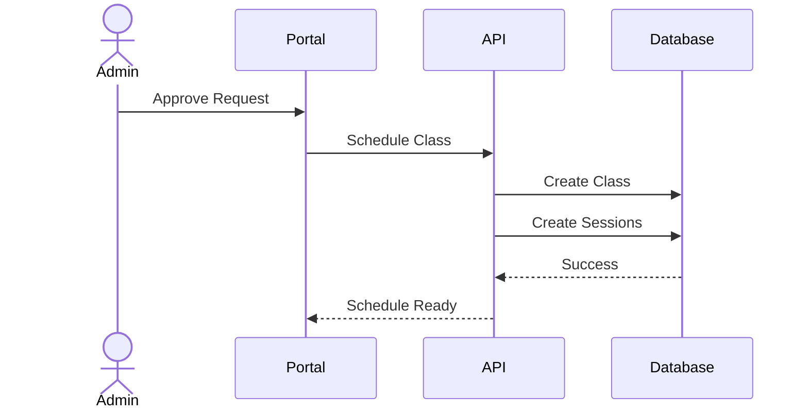
## Join Class

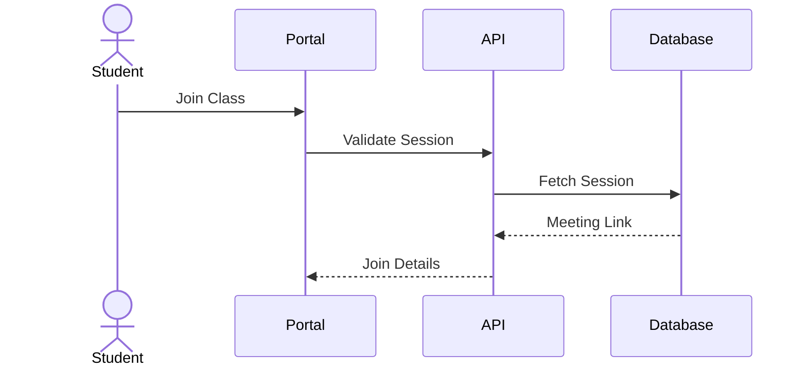
## Attendance Recording

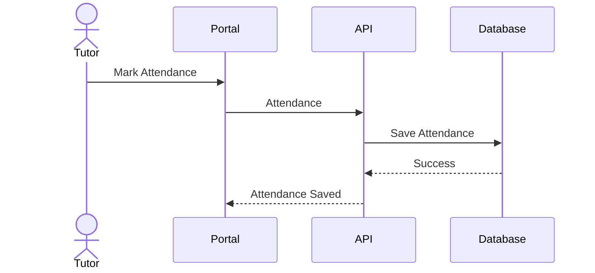
## Package Hour Deduction

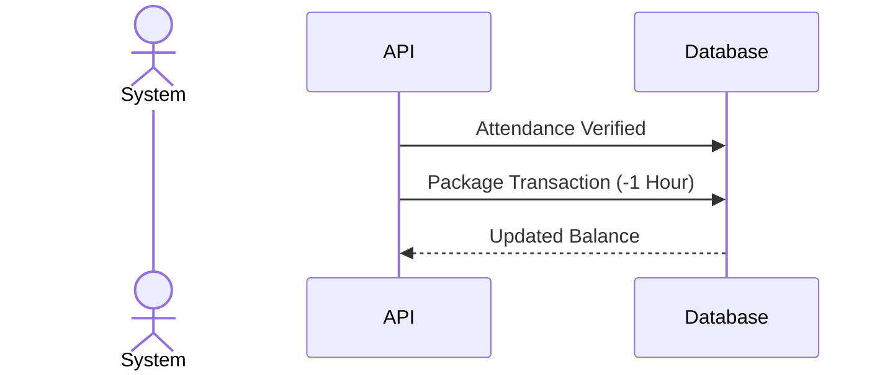
## Chat Messaging

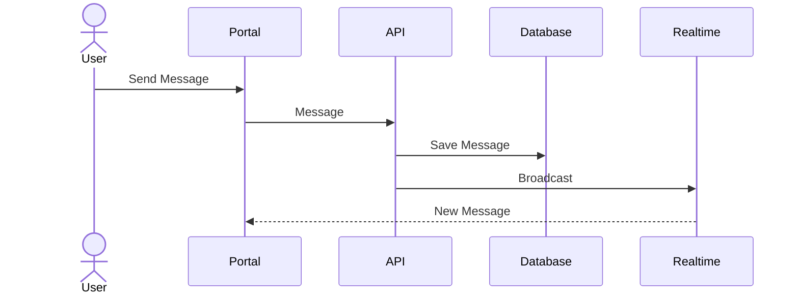
## Chat Moderation

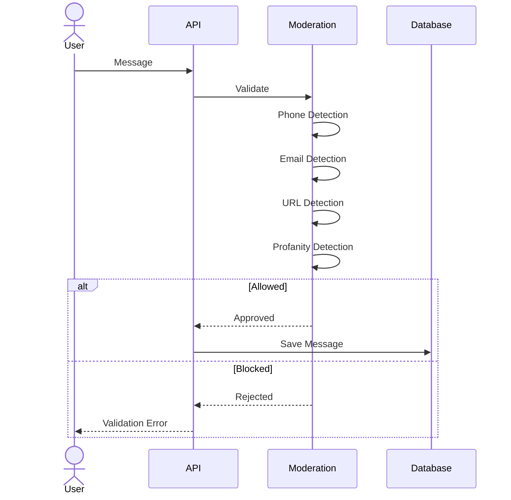
## Notification Flow

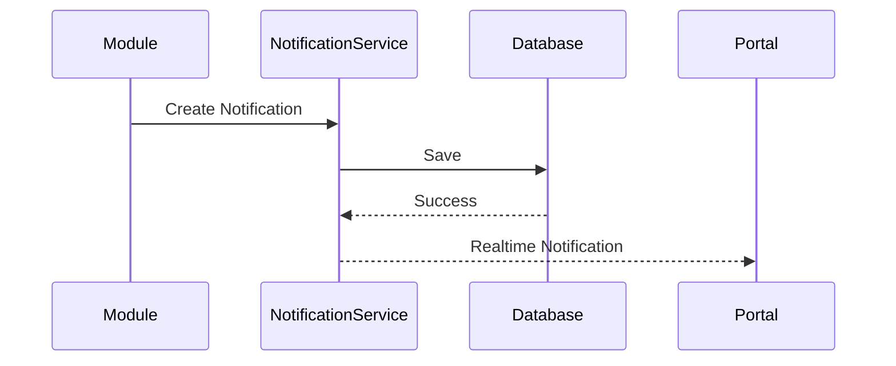
Class Request
        │
        ▼
Approved
        │
        ▼
Recurring Class Created
        │
        ▼
Weekly Session Generated
        │
        ▼
Tutor Starts Session
        │
        ▼
Student Joins
        │
        ▼
Attendance Recorded
        │
        ▼
Package Hour Deducted
        │
        ▼
Notification Sent
