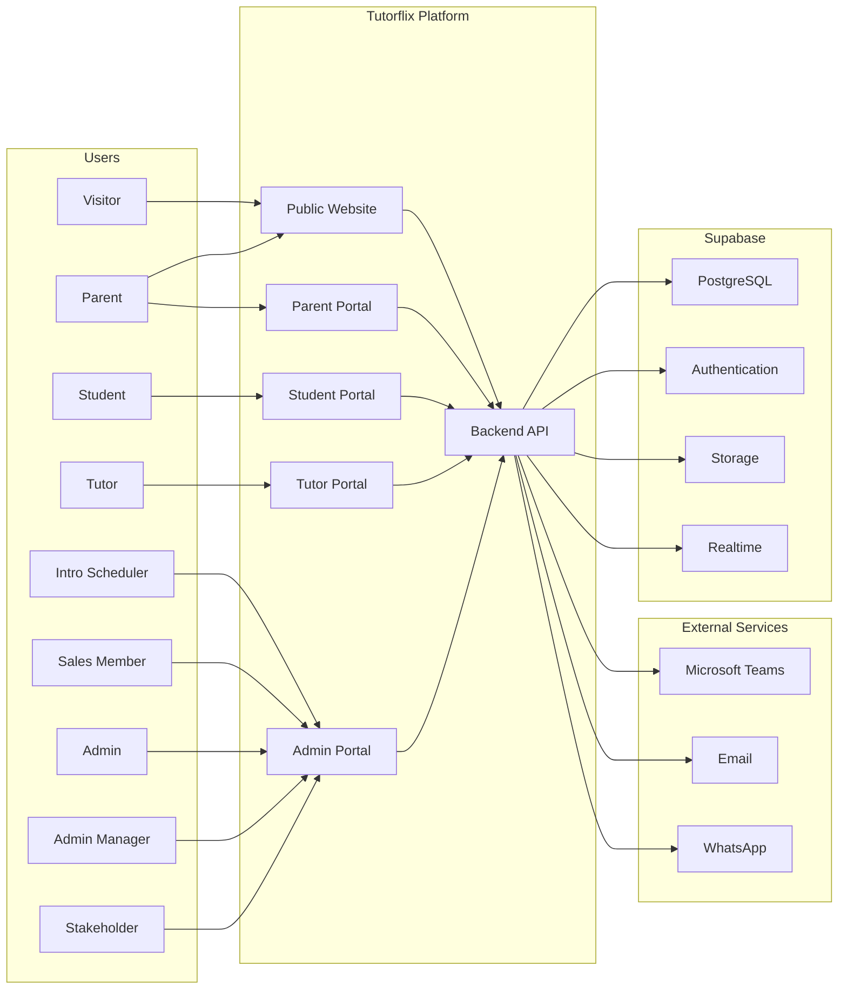

# System Context

## 1. Purpose

The Tutorflix platform is a multi-tenant Software-as-a-Service (SaaS) platform designed to manage the complete lifecycle of online tutoring, from initial lead acquisition to student enrollment, scheduling, tutoring sessions, communication, payment management, and reporting.

The system provides dedicated portals for different user roles while maintaining centralized business logic and a shared data platform. Access to system functionality is governed through Role-Based Access Control (RBAC), ensuring users can only perform actions permitted by their assigned role.

---

# 2. Goals

The primary objectives of the platform are:

- Capture and manage prospective student leads.
- Schedule and manage trial lessons.
- Convert leads into enrolled students.
- Manage tutors and their availability.
- Schedule and conduct online tutoring sessions.
- Track purchased and consumed lesson hours.
- Facilitate communication between students, parents, tutors, and administrators.
- Generate operational and business reports.
- Support multiple administrators while maintaining strict tenant isolation.

---

# 3. Stakeholders

The platform is used by the following actors.

## External Users

- Visitor
- Parent
- Student

## Internal Users

- Intro Scheduler
- Sales Member
- Tutor
- Admin
- Admin Manager
- Stakeholder

---

# 4. External Systems

The platform communicates with several external services.

| System | Purpose |
|---------|----------|
| Microsoft Teams | Online tutoring sessions |
| Email Provider | Notifications |
| WhatsApp Business API | Parent communication |
| Supabase | Authentication, Database, Storage, Realtime |

---

# 5. System Boundary

The Tutorflix Platform consists of the following applications.

- Public Website
- Admin Portal
- Student Portal
- Parent Portal
- Tutor Portal
- Backend API

The following services exist outside the platform boundary.

- Microsoft Teams
- Email Provider
- WhatsApp
- Browser
- Internet

---

# 6. High-Level Architecture

---

# 7. Architectural Principles

The platform is designed using the following principles.

- Separation of concerns
- Centralized business logic
- Role-based authorization
- Multi-tenant architecture
- Service-oriented backend
- API-first communication
- Stateless backend services
- Secure by default
- Modular domain design

---

# 8. Assumptions

- Every user authenticates using Supabase Authentication.
- All requests pass through RBAC before business logic execution.
- Business logic is executed exclusively within the Backend API.
- Portals never communicate directly with the database.
- File uploads are stored in Supabase Storage.
- Real-time messaging uses Supabase Realtime.
- Microsoft Teams hosts all online tutoring sessions.

---

# 9. Related Documents

- 02-container-architecture.md
- 03-backend-architecture.md
- 04-domain-architecture.md
- 05-database-architecture.md
