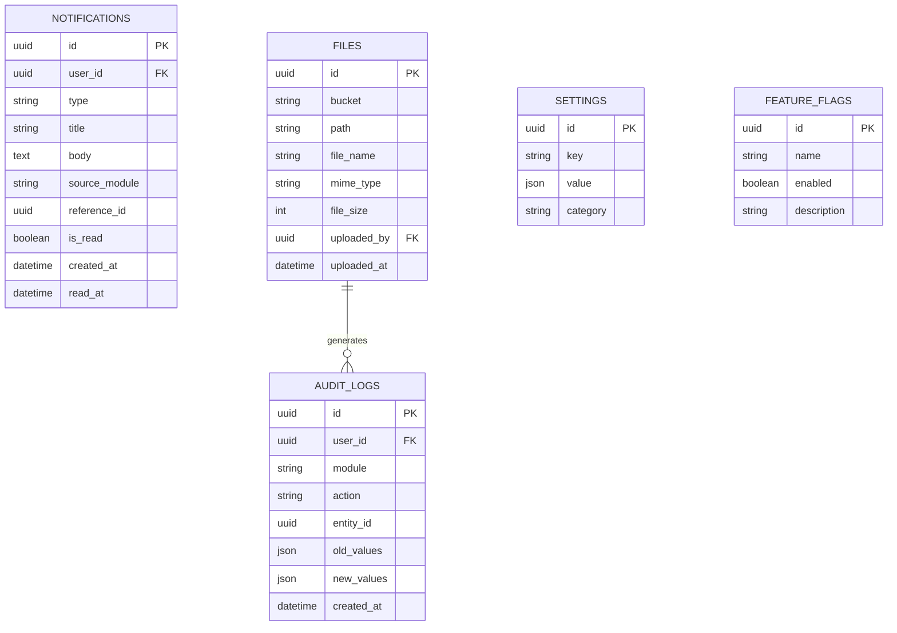
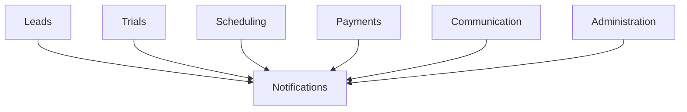

# 11. System ERD

## Purpose

This document defines the platform-wide operational entities that support all business domains.

Unlike the Business and Communication layers, these entities are shared across the entire application and are not owned by a single module.

---

# Entity Relationship Diagram

---

# Notification Sources

Notifications may originate from any module.

---

# Notification Examples

| Module | Event |
|----------|------------------------------|
| Communication | New message |
| Trials | Trial scheduled |
| Scheduling | Class reminder |
| Scheduling | Class cancelled |
| Payments | Payment approved |
| Payments | Payment rejected |
| Packages | Low remaining hours |
| Administration | New announcement |
| Tutors | Tutor assigned |
| Students | Welcome notification |

---

# Audit Logs

Audit Logs provide a permanent history of important business events.

Examples

- Lead converted
- Student created
- Tutor assigned
- Package updated
- Payment verified
- Message deleted
- User promoted
- Permission changed

Audit records are immutable and are never deleted.

---

# Files

Binary files are stored in Supabase Storage.

The Files table stores metadata only.

Examples

- Profile pictures
- Payment receipts
- Homework
- Assignments
- Chat attachments

---

# Settings

Stores configurable system settings.

Examples

- Academy working hours
- Trial duration
- Default lesson duration
- Time zone
- Chat moderation rules

---

# Feature Flags

Controls optional functionality without code changes.

Examples

- AI Moderation
- Stripe Payments
- PayPal Integration
- WhatsApp Notifications
- Parent Portal Beta

---

# Design Decisions

- Notifications are a shared platform service.
- Audit Logs record all important system actions.
- Files are stored in Supabase Storage with metadata stored in PostgreSQL.
- Settings are configurable without code changes.
- Feature Flags enable gradual rollout of new functionality.
